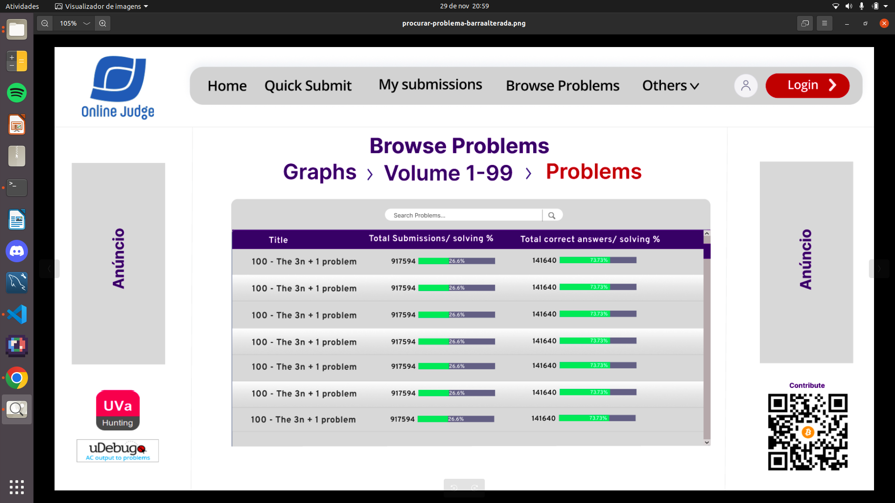

## Introdução

Esse artefato tem como objetivo registrar as descobertas obtidas ao avaliar o protótipo de alta fidelidade. Serão abordados os tópicos referidos no planejamento dos relatos dos resultados.

## Testes de Usabilidade

### **Teste de Usabilidade 1 (Suzane)**

#### 1.1 Objetivos e escopo da avaliação

Conforme consta no planejamento, entre as principais finalidades desta avaliação é possível mencionar a busca por problemas de usabilidade referente à interface proposta para o site do Online Judge, avaliar a eficácia do design, e coletar sugestões de melhorias relativas às tarefas de "Procurar um problema" e "Submeter um problema".

#### 1.2 Método de avaliação

Como proposto no planejamento da avaliação, o método empregado foi o método de observação, mais especificamente, o método de teste de usabilidade. Logo, de acordo com Barbosa e Silva, este método foi projetado para avaliar o desempenho dos usuários em determinada tarefa. Dessa forma, ao definir o Online Judge para realizar a avaliação, o perfil dos participantes e as duas atividades que eles iriam efetuar, cada membro realizou as atividades presencialmente conforme consta o cronograma realizado apresentados na tabela 1.

**Tabela 1** - Cronograma da avaliação do Protótipo de Alta Fidelidade - "Procurar um problema" e "Submeter um problema".

|                  Entrevistador                   |    Entrevistado(s)    | Horário de Início | Horário de Fim |    Data    |          Local          |
| :----------------------------------------------: | :-------------------: | :---------------: | :------------: | :--------: | :---------------------: |
| [Suzane Duarte](https://github.com/suzaneduarte) | Ana Carolina Monteiro |       13:00       |     13:30      | 29/11/2023 | Faculdade do Gama (FGA) |

Fonte: [Suzane Duarte](https://github.com/suzaneduarte)

#### 1.3 Perfil do participante

O perfil dos participantes do teste era de estudantes que já conheciam sites de juiz online para submissão de problemas de programação, de forma que foram recrutados sete pessoas ao total, dentre os quais cinco homens e duas mulheres.

#### 1.4 Problemas encontrados

Durante a avaliação, o usuário não apresentou dificuldades ou problemas para realizar as tarefas definidas para o teste de usabilidade.

#### 1.5 Sumário dos dados coletados

A seguir, é apresentado as tabelas 2 e 3 para que seja possível verificar as respostas obtidas durante o teste, e após o usuário finalizá-lo.

**Tabela 2** - Respostas obtidas durante o teste.

| Número da pergunta | Enunciado da pergunta                                                              | Resposta e Justificativa                                                         |
| ------------------ | ---------------------------------------------------------------------------------- | -------------------------------------------------------------------------------- |
| 1                  | Foi possível realizar a tarefa?                                                    | Sim, pois foi possível chegar ao final do que foi solicitado.                    |
| 2                  | Foi identificado algum problema de usabilidade?                                    | Não                                                                              |
| 3                  | A disposição dos elementos na tela facilitou ou dificultou a realização da tarefa? | Facilitou, devido as formas distintas utilizadas para diferenciar as atividades. |
| 4                  | Foi experienciada alguma dificuldade de entendimento do protótipo?                 | Não                                                                              |
| 5                  | Foi experienciada alguma dificuldade de realização da tarefa?                      | Não                                                                              |
| 6                  | Foi observada alguma sugestão de melhoria para o protótipo proposto?               | Sim, uma alteração da cor da barra da lista de procurando problema.              |

Fonte: [Suzane Duarte](https://github.com/suzaneduarte).

**Tabela 3** - Respostas obtidas após análise do avaliador.

| Número da pergunta | Enunciado da pergunta                                                  | Resposta e Justificativa                                                                           |
| ------------------ | ---------------------------------------------------------------------- | -------------------------------------------------------------------------------------------------- |
| 1                  | Quantos erros o usuário cometeu?                                       | 0                                                                                                  |
| 2                  | Quanto tempo foi necessário para a execução da tarefa?                 | Para a tarefa de "Procurar um problema", 1m14. Já para a atividade de "Submeter um problema", 40s. |
| 3                  | O usuário precisou de ajuda externa ou do sistema?                     | Não                                                                                                |
| 4                  | O usuário enfrentou algum problema para realizar a tarefa?             | Não                                                                                                |
| 5                  | O usuário demonstrou insatisfação ou teve dificuldade com a interface? | Não                                                                                                |
| 6                  | As dúvidas do usuário foram esclarecidas?                              | Sim                                                                                                |

Fonte: [Suzane Duarte](https://github.com/suzaneduarte).

[Link da gravação da entrevista](https://www.youtube.com/watch?v=jZ2TIIrFelc)

<iframe width="560" height="315" src="https://www.youtube.com/embed/VZ11QOdbLo4?si=uCVPeaHV3EgrOPHT" title="YouTube video player" frameborder="0" allow="accelerometer; autoplay; clipboard-write; encrypted-media; gyroscope; picture-in-picture; web-share" allowfullscreen></iframe>

#### 1.6 Análise e interpretação dos dados coletados

A partir dos dados coletados, como o tempo para conclusão da tarefa e o número de erros cometidos durante o teste, foi possível concluir que o protótipo de alta fidelidade apresenta clareza referente a usabilidade do usuário com o sistema a partir das experiências.

#### 1.7 Feedback do usuário

O usuário apresentou satisfação ao realizar todas as tarefas, porém, quando questionada especificamente sobre melhorias na forma de representação da tabela contendo a lista de problemas, ela apresenta como feedback uma alteração nas cores para representar as informações dispostas.

#### 1.8 Sugestões de melhoria

O usuário apresentou como sugestão de melhoria alterar a cor vermelha da barra apresentada na Imagem 1 a seguir:

**Imagem 1** - Versão do protótipo de alta fidelidade apresentado ao usuário

Fonte: [Suzane Duarte](https://github.com/suzaneduarte)

De forma que, a apresentação da porcentagem de pessoas que resolveu em formato de barra pudesse ser mantida, mas alterando a cor vermelha pois a cor pode gerar um pouco de confusão para quem olha rapidamente. Dessa forma, a cor da barra foi alterada para uma cor mais neutra, e também outros itens da tabela foram modificados para que fosse possível ornar melhor com a alteração realizada através do feedback do usuário, conforme pode ser visto na Imagem 2 a seguir.

**Imagem 2** - Versão do protótipo de alta fidelidade com alterações após feedbacks do usuário

Fonte: [Suzane Duarte](https://github.com/suzaneduarte)

### **Teste de Usabilidade 2 (Pablo)**

#### 2.1 Objetivos e escopo da avaliação

A avalição do protótipo de alta fidelidade contou com três tarefas, "Browse Problems", "Quick Submit" e "My submissions". Esta avaliação tem como objetivo detectar possíveis problemas, avaliar a eficácia do design, assim como verificar a conformidade com as tarefas elaboradas.

#### 2.2 Método de avaliação

Como proposto no planejamento da avaliação, o método empregado foi o método de observação, mais especificamente, o método de teste de usabilidade. Este método permite avaliar, a partir da experiência do usuário com a interface do protótipo criado, os critérios definidos para o projeto e o avanço alcançado no seu atingimento, conforme definição nas [Metas de Usabilidade](https://interacao-humano-computador.github.io/2023.2-OnlineJudge/terceira-entrega/metas-usabilidade/#metas-a-serem-alcancadas). Os dados da entrevista estão representados na tabela 4.

**Tabela 4** - Cronograma da avaliação do Protótipo de Alta Fidelidade - "Browse Problems", "Quick Submit" e "My submissions"

|                  Entrevistador                  | Entrevistado(s) | Horário de Início | Horário de Fim |    Data    |       Local       |
| :---------------------------------------------: | :-------------: | :---------------: | :------------: | :--------: | :---------------: |
| [Pablo Guilherme](https://github.com/PabloGJBS) | Gabriel Mariano |       13:40       |     13:45      | 29/11/2023 | Faculdade do Gama |

Fonte: [Pablo Guilherme](https://github.com/PabloGJBS)

#### 2.3 Perfil do participante

O participante selecionado se encaixa com o perfil de usuário definido no projeto. Ele é estudante do curso Engenharia de Software com experiência média em tecnologia e é tecnófila. Além disso, está entre a faixa de idade definida pelo perfil de usuário (19 a 24 anos).

#### 2.4 Problemas encontrados

Durante a avaliação, o usuário não apresentou nenhuma dificuldade ou problema para realizar o teste de usabilidade e as tarefas definidas.

#### 2.5 Sumário dos dados coletados

Nas tabelas 5 e 6 é posível verificar as respostas obtidas durante a avaliação e após.

**Tabela 5** - Respostas obtidas durante a avaliação.

| Número da pergunta | Enunciado da pergunta                                                              | Resposta e Justificativa                               |
| ------------------ | ---------------------------------------------------------------------------------- | ------------------------------------------------------ |
| 1                  | Foi possível realizar a tarefa?                                                    | Sim todas as tarefas foram realizadas de maneira clara |
| 2                  | Foi identificado algum problema de usabilidade?                                    | Não                                                    |
| 3                  | A disposição dos elementos na tela facilitou ou dificultou a realização da tarefa? | Facilitou                                              |
| 4                  | Foi experienciada alguma dificuldade de entendimento do protótipo?                 | Não                                                    |
| 5                  | Foi experienciada alguma dificuldade de realização da tarefa?                      | Não                                                    |
| 6                  | Foi observada alguma sugestão de melhoria para o protótipo proposto?               | Não                                                    |

Fonte: [Pablo Guilherme](https://github.com/PabloGJBS).

**Tabela 6** - Respostas obtidas após análise do avaliador.

| Número da pergunta | Enunciado da pergunta                                                  | Resposta e Justificativa      |
| ------------------ | ---------------------------------------------------------------------- | ----------------------------- |
| 1                  | Quantos erros o usuário cometeu?                                       | 0                             |
| 2                  | Quanto tempo foi necessário para a execução da tarefa?                 | cerca de 1 minuto cada tarefa |
| 3                  | O usuário precisou de ajuda externa ou do sistema?                     | Não                           |
| 4                  | O usuário enfrentou algum problema para realizar a tarefa?             | Não                           |
| 5                  | O usuário demonstrou insatisfação ou teve dificuldade com a interface? | Não                           |
| 6                  | As dúvidas do usuário foram esclarecidas?                              | Sim                           |

Fonte: [Pablo Guilherme](https://github.com/PabloGJBS).

[Link da gravação da entrevista](https://www.youtube.com/watch?v=jZ2TIIrFelc)

<iframe width="1185" height="480" src="https://www.youtube.com/embed/jZ2TIIrFelc" title="Entrevista prototipo de alta fidelidade com Gabriel Mariano" frameborder="0" allow="accelerometer; autoplay; clipboard-write; encrypted-media; gyroscope; picture-in-picture; web-share" allowfullscreen></iframe>

#### 2.6 Análise e interpretação dos dados coletados

A partir dos dados coletados durante a entrevista foi possivel verificar que o usuário não possuiu nenhuma dificuldade na utilização do sistema proposto.

#### 2.7 Feedback do usuário

O usuário deu um feedback positivo em relação a organização das paginas e do funcionamento esperado do protótipo afirmou que era bem claro e objetivo e que acreditava que este era o propósito do produto.

#### 2.8 Sugestões de melhoria

Não existiu nenhuma proposta de melhoria para o protótipo.

### **Teste de Usabilidade 3 (Eric)**

#### 3.1 Objetivos e escopo da avaliação

A análise do modelo de alta fidelidade envolveu a execução de duas atividades específicas: "Quick Submit" e "Contact Us". O propósito subjacente a essa avaliação consistiu em identificar potenciais desafios, avaliar a eficácia do design e assegurar a conformidade com as tarefas delineadas.

#### 3.2 Método de avaliação

Conforme delineado no plano de avaliação, a abordagem adotada consistiu no método de observação, mais precisamente, no método de teste de usabilidade. Este método viabiliza a avaliação dos critérios estabelecidos para o projeto, bem como a análise do progresso alcançado na sua consecução, com base na interação do usuário com a interface do protótipo desenvolvido. Os parâmetros para o projeto e os avanços obtidos em sua realização foram definidos nas [Metas de Usabilidade](https://interacao-humano-computador.github.io/2023.2-OnlineJudge/terceira-entrega/metas-usabilidade/#metas-a-serem-alcancadas). Os dados provenientes das entrevistas estão apresentados na tabela a seguir

**Tabela 7** - Cronograma da avaliação do Protótipo de Alta Fidelidade - "Quick Submit" e "Contact Us"

|                Entrevistador                | Entrevistado(s) | Horário de Início | Horário de Fim |    Data    |       Local       |
| :-----------------------------------------: | :-------------: | :---------------: | :------------: | :--------: | :---------------: |
| [Eric Camargo](https://github.com/Ericcs10) |      André      |       13:45       |     13:50      | 29/11/2023 | Faculdade do Gama |

Fonte: [Eric Camargo](https://github.com/Ericcs10)

#### 3.3 Perfil do participante

O indivíduo escolhido para participar está alinhado com o perfil de usuário estipulado no projeto. Trata-se de um estudante do curso de Engenharia de Software, apresentando uma experiência tecnológica moderada e uma afinidade notável com a tecnologia. Adicionalmente, sua faixa etária está compreendida dentro dos limites estabelecidos pelo perfil de usuário, situando-se entre 19 e 24 anos

#### 3.4 Problemas encontrados

Ao longo da avaliação, o participante não manifestou qualquer dificuldade ou problema ao conduzir o teste de usabilidade e executar as tarefas designadas.

#### 3.5 Sumário dos dados coletados

Na tabela 8 e 9 é posível verificar as respostas obtidas durante a avaliação e após.

**Tabela 8** - Respostas obtidas durante a avaliação.

| Número da pergunta | Enunciado da pergunta                                                              | Resposta e Justificativa                                        |
| ------------------ | ---------------------------------------------------------------------------------- | --------------------------------------------------------------- |
| 1                  | Foi possível realizar a tarefa?                                                    | Sim todas as tarefas foram realizadas de maneira clara          |
| 2                  | Foi identificado algum problema de usabilidade?                                    | Não                                                             |
| 3                  | A disposição dos elementos na tela facilitou ou dificultou a realização da tarefa? | Facilitou                                                       |
| 4                  | Foi experienciada alguma dificuldade de entendimento do protótipo?                 | Não                                                             |
| 5                  | Foi experienciada alguma dificuldade de realização da tarefa?                      | Não                                                             |
| 6                  | Foi observada alguma sugestão de melhoria para o protótipo proposto?               | O usuário achou interessante que as cores fossem reconsideradas |

Fonte: [Eric Camargo](https://github.com/Ericcs10).

**Tabela 9** - Respostas obtidas após análise do avaliador.

| Número da pergunta | Enunciado da pergunta                                                  | Resposta e Justificativa      |
| ------------------ | ---------------------------------------------------------------------- | ----------------------------- |
| 1                  | Quantos erros o usuário cometeu?                                       | 0                             |
| 2                  | Quanto tempo foi necessário para a execução da tarefa?                 | cerca de 1 minuto cada tarefa |
| 3                  | O usuário precisou de ajuda externa ou do sistema?                     | Não                           |
| 4                  | O usuário enfrentou algum problema para realizar a tarefa?             | Não                           |
| 5                  | O usuário demonstrou insatisfação ou teve dificuldade com a interface? | Não                           |
| 6                  | As dúvidas do usuário foram esclarecidas?                              | Sim                           |

Fonte: [Eric Camargo](https://github.com/Ericcs10).

[Link da gravação da entrevista](https://youtu.be/4wz3twrxB3w)

<iframe width="560" height="315" src="https://www.youtube.com/embed/4wz3twrxB3w?si=IjQWdr0xokHiAwo6" title="YouTube video player" frameborder="0" allow="accelerometer; autoplay; clipboard-write; encrypted-media; gyroscope; picture-in-picture; web-share" allowfullscreen></iframe>

#### 3.6 Análise e interpretação dos dados coletados

A partir dos dados coletados durante a entrevista foi possivel verificar que o usuário não possuiu nenhuma dificuldade na utilização do sistema proposto.

#### 3.7 Feedback do usuário

O usuário deu um feedback positivo em relação a organização das paginas e do funcionamento esperado do protótipo afirmou que era bem claro e objetivo e que acreditava que este era o propósito do produto.

#### 3.8 Sugestões de melhoria

Não existiu nenhuma proposta de melhoria para a usabilidade do protótipo, apenas nas cores escolhidas

### **Teste de Usabilidade 4 (Luana)**

#### 4.1 Objetivos e escopo da avaliação

A avaliação do protótipo de alta fidelidade contou com 2 tarefas, "Editar Conta" e "Submeter Problema". Esta avaliação tem como objetivo detectar possíveis problemas, avaliar a eficácia do design, assim como verificar a conformidade com as tarefas elaboradas.

#### 4.2 Método de avaliação

Como proposto no planejamento da avaliação, o método empregado foi o método de observação, mais especificamente, o método de teste de usabilidade. Este método permite avaliar, a partir da experiência do usuário com a interface do protótipo criado, os critérios definidos para o projeto e o avanço alcançado no seu atingimento, conforme definição nas [Metas de Usabilidade](https://interacao-humano-computador.github.io/2023.2-OnlineJudge/terceira-entrega/metas-usabilidade/#metas-a-serem-alcancadas).Os dados da entrevista estão representados na tabela 10.

**Tabela 10** - Cronograma da avaliação do Protótipo de Alta Fidelidade - "Editar Conta" e "Submeter Problema".

|                  Entrevistador                  | Entrevistado(s) | Horário de Início | Horário de Fim |    Data    |       Local       |
| :---------------------------------------------: | :-------------: | :---------------: | :------------: | :--------: | :---------------: |
| [Luana Torres](https://github.com/luanatorress) | Isadora Maciel  |       11:00       |     11:30      | 29/11/2023 | Faculdade do Gama |

Fonte: [Luana Torres](https://github.com/luanatorress)

#### 4.3 Perfil do participante

A participante selecionada se encaixa com o perfil de usuário definido no projeto. Ela é estudante do curso Engenharia de Energia com experiência média em tecnologia e é tecnófila. Além disso, está entre a faixa de idade definida pelo perfil de usuário (19 a 24 anos).

#### 4.4 Problemas encontrados

Durante a avaliação, o usuário não apresentou nenhuma dificuldade ou problema para realizar o teste de usabilidade e as tarefas definidas.

#### 4.5 Sumário dos dados coletados

Na tabela 11 e 12 é posível verificar as respostas obtidas durante a avaliação e após.

**Tabela 11** - Respostas obtidas durante a avaliação.

| Número da pergunta | Enunciado da pergunta                                                              | Resposta e Justificativa |
| ------------------ | ---------------------------------------------------------------------------------- | ------------------------ |
| 1                  | Foi possível realizar a tarefa?                                                    | Sim                      |
| 2                  | Foi identificado algum problema de usabilidade?                                    | Não                      |
| 3                  | A disposição dos elementos na tela facilitou ou dificultou a realização da tarefa? | Facilitou                |
| 4                  | Foi experienciada alguma dificuldade de entendimento do protótipo?                 | Não                      |
| 5                  | Foi experienciada alguma dificuldade de realização da tarefa?                      | Não                      |
| 6                  | Foi observada alguma sugestão de melhoria para o protótipo proposto?               | Não                      |

Fonte: [Luana Torres](https://github.com/luanatorress).

**Tabela 12** - Respostas obtidas após análise do avaliador.

| Número da pergunta | Enunciado da pergunta                                                  | Resposta e Justificativa |
| ------------------ | ---------------------------------------------------------------------- | ------------------------ |
| 1                  | Quantos erros o usuário cometeu?                                       | 0                        |
| 2                  | Quanto tempo foi necessário para a execução da tarefa?                 | 40 segundos              |
| 3                  | O usuário precisou de ajuda externa ou do sistema?                     | Não                      |
| 4                  | O usuário enfrentou algum problema para realizar a tarefa?             | Não                      |
| 5                  | O usuário demonstrou insatisfação ou teve dificuldade com a interface? | Não                      |
| 6                  | As dúvidas do usuário foram esclarecidas?                              | Sim                      |

Fonte: [Luana Torres](https://github.com/luanatorress).

[Link da gravação da entrevista](https://www.youtube.com/watch?v=itI5F5zmLk8)

<iframe width="560" height="315" src="https://www.youtube.com/embed/itI5F5zmLk8?si=aSdvnL-eb9tSL6Kw" title="YouTube video player" frameborder="0" allow="accelerometer; autoplay; clipboard-write; encrypted-media; gyroscope; picture-in-picture; web-share" allowfullscreen></iframe>

#### 4.6 Análise e interpretação dos dados coletados

A partir dos dados coletados, é possível observar que o protótipo de alta fidelidade é fácil e intuitivo. Além de tudo, ele cumpre sua função de avaliar a eficácia do design. A partir das respostas obtidas, observa-se que o design foi eficiente e que não houveram dificuldades no entendimento e realização das tarefas.

#### 4.7 Feedback do usuário

O usuário demonstrou facilidade para compreender a interface e as tarefas realizadas. Demonstrou satisfação em relação ao design proposto.

#### 4.8 Sugestões de melhoria

O usuário não apresentou sugestão de melhoria por acreditar não ser necessário.

### **Teste de Usabilidade 5 (Ester)**

#### 5.1 Objetivos e escopo da avaliação

O Teste de Usabilidade realizado para o Protótipo de Alta Fidelidade avaliou duas tarefas, "Acessar o Past Contest" e "Editar Conta". Esta avaliação tem como objetivo detectar possíveis problemas de usabilidade do Protótiopo de Alta Fidelidade, além de avaliar o design e verificar a conformidade com as tarefas elaboradas.

#### 5.2 Método de avaliação

Como proposto no [Planejamento da Avaliação do Protótipo de Alta Fidelidade](https://interacao-humano-computador.github.io/2023.2-OnlineJudge/quarta-entrega/nivel3/planejamento-avaliacao-prototipo-alta-fidelidade/), o método empregado foi o método de observação, mais especificamente, o método de teste de usabilidade. Este método permite avaliar, a partir da experiência do usuário com a interface do protótipo criado, os critérios definidos para o projeto e o avanço alcançado no seu atingimento, conforme definição nas [Metas de Usabilidade](https://interacao-humano-computador.github.io/2023.2-OnlineJudge/terceira-entrega/metas-usabilidade/#metas-a-serem-alcancadas). O planejamneto do teste de usabilidade está apresentado na tabela 13.

**Tabela 13** - Cronograma da avaliação do Protótipo de Alta Fidelidade - Acessar o Past Contest e Editar Conta.

|                Entrevistador                |  Entrevistado(s)  | Horário de Início | Horário de Fim |    Data    |       Local       |
| :-----------------------------------------: | :---------------: | :---------------: | :------------: | :--------: | :---------------: |
| [Ester Lino](https://github.com/esteerlino) | Emivalto da Costa |       11:40       |     12:10      | 29/11/2023 | Faculdade do Gama |

Fonte: [Ester Lino](https://github.com/esteerlino)

#### 5.3 Perfil do participante

O participante selecionado se encaixa com o perfil de usuário definido no projeto. Ele é estudante do curso Engenharia de Software com experiência média em tecnologia e é tecnófila. Além disso, está entre a faixa de idade definida pelo perfil de usuário (19 a 24 anos).

#### 5.4 Problemas encontrados

Durante a avaliação, o usuário teve dificuldade em encontrar a página "System Contest", a qual contém o link de acesso à página da tarefa proposta ("Past Contest").

#### 5.5 Sumário dos dados coletados

Na tabela 14 é possível verificar as respostas obtidas durante o teste de usabilidade. E na tabela 15 estão apresentadas a análise do avaliador sobre a sessão realizada.

**Tabela 14** - Respostas obtidas durante a avaliação.

| Número da pergunta | Enunciado da pergunta                                                              | Resposta e Justificativa |
| ------------------ | ---------------------------------------------------------------------------------- | ------------------------ |
| 1                  | Foi possível realizar a tarefa?                                                    | Sim                      |
| 2                  | Foi identificado algum problema de usabilidade?                                    | Não                      |
| 3                  | A disposição dos elementos na tela facilitou ou dificultou a realização da tarefa? | Facilitou                |
| 4                  | Foi experienciada alguma dificuldade de entendimento do protótipo?                 | Não                      |
| 5                  | Foi experienciada alguma dificuldade de realização da tarefa?                      | Não                      |
| 6                  | Foi observada alguma sugestão de melhoria para o protótipo proposto?               | Não                      |

Fonte: [Ester Lino](https://github.com/esteerlino).

**Tabela 15** - Respostas obtidas após análise do avaliador.

| Número da pergunta | Enunciado da pergunta                                                  | Resposta e Justificativa                                                                                                      |
| ------------------ | ---------------------------------------------------------------------- | ----------------------------------------------------------------------------------------------------------------------------- |
| 1                  | Quantos erros o usuário cometeu?                                       | Para acessar o Past Conteste, o usuário cometeu 2 erros. Já para realizar a tarefa de Editar Conta, nenhum erro foi cometido. |
| 2                  | Quanto tempo foi necessário para a execução da tarefa?                 | Acessar Past Contest: 52 segundos e Editar Conta: 24 segundos.                                                                |
| 3                  | O usuário precisou de ajuda externa ou do sistema?                     | Sim. Foi preciso esclarecer que o header continham links de acessos às páginas.                                               |
| 4                  | O usuário enfrentou algum problema para realizar a tarefa?             | Sim. O participante teve dificuldade de encontrar a página solicitada na primeira tarefa.                                     |
| 5                  | O usuário demonstrou insatisfação ou teve dificuldade com a interface? | O participante teve algumas dificuldades, mas não demonstrou insatisfação.                                                    |
| 6                  | As dúvidas do usuário foram esclarecidas?                              | Sim                                                                                                                           |

Fonte: [Ester Lino](https://github.com/esteerlino).

[Link da gravação da entrevista](https://www.youtube.com/watch?v=bidzhrtmMng)

<iframe width="560" height="315" src="https://www.youtube.com/embed/bidzhrtmMng?si=aSdvnL-eb9tSL6Kw" title="YouTube video player" frameborder="0" allow="accelerometer; autoplay; clipboard-write; encrypted-media; gyroscope; picture-in-picture; web-share" allowfullscreen></iframe>

#### 5.6 Análise e interpretação dos dados coletados

A partir dos dados coletados, é possível observar que o protótipo de alta fidelidade é intuitivo e cumpre sua função de avaliar a eficácia do design. A partir das respostas obtidas, observa-se que o design pode melhorar sua eficiência, dispondo todos os links importantes no header, a fim de facilitar a busca do usuário.

#### 5.7 Feedback do usuário

O usuário conseguiu compreender e realizar as tarefas solicitadas, mas para ele é necessário mudar a rota da página "Past Contest".

#### 5.8 Sugestões de melhoria

O usuário sugeriu que o "System Contest" estivesse mais acessível. Ele sugeriu que no haeder fosse adicionado mais um link de acesso rápido para a página, porque no atual design ela se encontra dentro de outro link ("Others") o que dificulta o acesso.

### **Teste de Usabilidade 6 (Kallyne)**

#### 6.1 Objetivos e escopo da avaliação

A avaliação do protótipo de alta fidelidade abrangeu a realização de 2 tarefas, sendo elas "Recuperar login" e "Editar Conta", objetivando detectar possíveis problemas de usabilidade, avaliar a eficácia do design proposto e verificar a conformidade com as tarefas elaboradas na respectiva análise, de forma a avaliar a qualidade do protótipo como um todo.

#### 6.2 Método de avaliação

Como proposto no planejamento da avaliação, o método empregado foi o método de observação, mais especificamente, o método de teste de usabilidade. Este método permite avaliar, a partir da experiência do usuário com a interface do protótipo criado, os critérios definidos para o projeto e o avanço alcançado no seu atingimento, conforme definição nas [Metas de Usabilidade](https://interacao-humano-computador.github.io/2023.2-OnlineJudge/terceira-entrega/metas-usabilidade/#metas-a-serem-alcancadas). Os dados da entrevista estão representados na tabela 16.

**Tabela 16** - Cronograma da avaliação do Protótipo de Alta Fidelidade - Recuperação de login e editar conta.

|                  Entrevistador                  | Entrevistado(s) | Horário de Início | Horário de Fim |    Data    |  Local   |
| :---------------------------------------------: | :-------------: | :---------------: | :------------: | :--------: | :------: |
| [Kallyne Macedo](https://github.com/kalipassos) |   Luísa Musse   |       16:00       |     16:15      | 29/11/2023 | Gama, DF |

Fonte: [Kallyne Macedo](https://github.com/kalipassos)

#### 6.3 Perfil do participante

A participante selecionada se encaixa com o perfil de usuário definido no projeto. Ela é estudante do curso Engenharia Aeroespacial com experiência média em tecnologia e programação e é tecnófila. Além disso, está entre a faixa de idade definida pelo perfil de usuário (19 a 24 anos).

#### 6.4 Problemas encontrados

A participante obteve dificuldade em selecionar a foto desejada na edição do perfil por não estar prototipada, entretanto não sinalizou nenhum impedimento na realização das duas tarefas.

#### 6.5 Sumário dos dados coletados

Na tabela 17 é possível verificar as respostas obtidas durante o teste de usabilidade e na tabela 18 estão apresentadas a análise do avaliador sobre a sessão realizada.

**Tabela 17** - Respostas obtidas durante a avaliação.

| Número da pergunta | Enunciado da pergunta                                                              | Resposta e Justificativa |
| ------------------ | ---------------------------------------------------------------------------------- | ------------------------ |
| 1                  | Foi possível realizar a tarefa?                                                    | Sim                      |
| 2                  | Foi identificado algum problema de usabilidade?                                    | Não                      |
| 3                  | A disposição dos elementos na tela facilitou ou dificultou a realização da tarefa? | Facilitou                |
| 4                  | Foi experienciada alguma dificuldade de entendimento do protótipo?                 | Não                      |
| 5                  | Foi experienciada alguma dificuldade de realização da tarefa?                      | Não                      |
| 6                  | Foi observada alguma sugestão de melhoria para o protótipo proposto?               | Não                      |

Fonte: [Kallyne Macedo](https://github.com/kalipassos).

**Tabela 18** - Respostas obtidas após análise do avaliador.

| Número da pergunta | Enunciado da pergunta                                                  | Resposta e Justificativa                                  |
| ------------------ | ---------------------------------------------------------------------- | --------------------------------------------------------- |
| 1                  | Quantos erros o usuário cometeu?                                       | Nenhum erro foi cometido.                                 |
| 2                  | Quanto tempo foi necessário para a execução da tarefa?                 | Recuperar login: 37 segundos / Editar Conta: 59 segundos. |
| 3                  | O usuário precisou de ajuda externa ou do sistema?                     | Não.                                                      |
| 4                  | O usuário enfrentou algum problema para realizar a tarefa?             | Não.                                                      |
| 5                  | O usuário demonstrou insatisfação ou teve dificuldade com a interface? | O participante não demonstrou insatisfação.               |
| 6                  | As dúvidas do usuário foram esclarecidas?                              | Sim                                                       |

Fonte: [Kallyne Macedo](https://github.com/kalipassos).

[Link da gravação da entrevista](https://www.youtube.com/embed/U3yngOK0G_A?si=xiplmCu94Z77qpbm)

<iframe width="560" height="315" src="https://www.youtube.com/embed/U3yngOK0G_A?si=xiplmCu94Z77qpbm" title="YouTube video player" frameborder="0" allow="accelerometer; autoplay; clipboard-write; encrypted-media; gyroscope; picture-in-picture; web-share" allowfullscreen></iframe>

#### 6.6 Análise e interpretação dos dados coletados

A partir dos dados coletados, é possível observar que o protótipo de alta fidelidade é fácil e intuitivo. Além de tudo, ele cumpre sua função de avaliar a eficácia do design. A partir das respostas obtidas, observa-se que o design foi eficiente e que não houveram dificuldades no entendimento e realização das tarefas.

#### 6.7 Feedback do usuário

A participante destacou, de maneira positiva e identificando como um fator facilitador da navegação na interface, a conformidade do protótipo com as convenções gerais de design, como a padronização do botão de login no topo direito da tela. Além disso, a participante explorou as páginas e buscou verificar se as alterações que fez no protótipo eram salvas em memória. Após notar que não eram, não mostrou insatisfação. Por fim, pontuou que a interface está acessível e é fácil de localizar as funções desejadas.

#### 6.8 Sugestões de melhoria

A participante não sugeriu nenhuma melhoria na disposição da interface, mas pontuou o armazenamento das alterações em memória do protótipo como algo positivo a se acrescentar.

[Link da gravação da entrevista](https://youtu.be/jLxI51pckNU)

<iframe width="560" height="315" src="https://www.youtube.com/embed/jLxI51pckNU?si=FgPP4xTLzW1n2-pa" title="YouTube video player" frameborder="0" allow="accelerometer; autoplay; clipboard-write; encrypted-media; gyroscope; picture-in-picture; web-share" allowfullscreen></iframe>

### **Teste de Usabilidade 7 (Henrique)**

#### 7.1 Objetivos e escopo da avaliação

A avaliação do Protótipo de Alta Fidelidade, por meio do Teste de Usabilidade, abrangeu duas atividades específicas: "Acessar submissões" e "Editar Conta". Essa análise busca identificar eventuais questões relacionadas à usabilidade do Protótipo de Alta Fidelidade, ao mesmo tempo em que examina o design e assegura a conformidade com as tarefas propostas.

#### 7.2 Método de avaliação

Como proposto no planejamento da avaliação, o método empregado foi o método de observação, mais especificamente, o método de teste de usabilidade. Este método permite avaliar, a partir da experiência do usuário com a interface do protótipo criado, os critérios definidos para o projeto e o avanço alcançado no seu atingimento, conforme definição nas [Metas de Usabilidade](https://interacao-humano-computador.github.io/2023.2-OnlineJudge/terceira-entrega/metas-usabilidade/#metas-a-serem-alcancadas).Os dados da entrevista estão representados na tabela 19.

**Tabela 19** - Cronograma da avaliação do Protótipo de Alta Fidelidade - Acessar a página de minhas submissões.

|                    Entrevistador                    | Entrevistado(s)  | Horário de Início | Horário de Fim |    Data    |       Local       |
| :-------------------------------------------------: | :--------------: | :---------------: | :------------: | :--------: | :---------------: |
| [Henrique Torres](https://github.com/henriqtorresl) | João Pedro Gomes |       13:00       |     13:10      | 29/11/2023 | Faculdade do Gama |

Fonte: [Henrique Torres](https://github.com/henriqtorresl)

#### 7.3 Perfil do participante

O participante que foi entrevistado está de acordo com o perfil de usuário pré estabelecido no projeto.
É estudante da FGA com experiência média em tecnologia e está entre a faixa de idade definida pelo perfil de usuário (19 a 24 anos).

#### 7.4 Problemas encontrados

Não foram encontrados problemas durante a avaliação.

#### 7.5 Sumário dos dados coletados

Na tabela 20 e 21 é possível verificar as respostas obtidas durante a avaliação e após.

**Tabela 20** - Respostas obtidas durante a avaliação.

| Número da pergunta | Enunciado da pergunta                                                              | Resposta e Justificativa          |
| ------------------ | ---------------------------------------------------------------------------------- | --------------------------------- |
| 1                  | Foi possível realizar a tarefa?                                                    | Sim, foi possível.                |
| 2                  | Foi identificado algum problema de usabilidade?                                    | Não                               |
| 3                  | A disposição dos elementos na tela facilitou ou dificultou a realização da tarefa? | Facilitou, estava tudo bem claro! |
| 4                  | Foi experienciada alguma dificuldade de entendimento do protótipo?                 | Não.                              |
| 5                  | Foi experienciada alguma dificuldade de realização da tarefa?                      | Não.                              |
| 6                  | Foi observada alguma sugestão de melhoria para o protótipo proposto?               | Não possuo sugestões de melhoria. |

Fonte: [Henrique Torres](https://github.com/henriqtorresl).

**Tabela 21** - Respostas obtidas após análise do avaliador.

| Número da pergunta | Enunciado da pergunta                                                  | Resposta e Justificativa          |
| ------------------ | ---------------------------------------------------------------------- | --------------------------------- |
| 1                  | Quantos erros o usuário cometeu?                                       | Com relação a navegação, nenhum.  |
| 2                  | Quanto tempo foi necessário para a execução da tarefa?                 | Em média, 15 segundos por tarefa. |
| 3                  | O usuário precisou de ajuda externa ou do sistema?                     | Não.                              |
| 4                  | O usuário enfrentou algum problema para realizar a tarefa?             | Não.                              |
| 5                  | O usuário demonstrou insatisfação ou teve dificuldade com a interface? | Não.                              |
| 6                  | As dúvidas do usuário foram esclarecidas?                              | Não houveram dúvidas.             |

Fonte: [Henrique Torres](https://github.com/henriqtorresl).

#### 7.6 Análise e interpretação dos dados coletados

A partir da avaliação, foi possível perceber que o fluxo realizado no protótipo (acessar a página de minhas submissões) está claro e de fácil usabilidade.

#### 7.7 Feedback do usuário

O usuário sentiu facilidade e conforto ao navegar no protótipo de alta fidelidade.

#### 7.8 Sugestões de melhoria

O usuário entrevistado não sugeriu nenhuma melhoria.

## Bibliografia

> <a id="REF1" href="#anchor_1">1.</a> BARBOSA, S. D. J.; SILVA, B. S. Interação Humano-Computador. Rio de Janeiro: Elsevier, 2011.

## Hitórico de versão

| Versão | Data       | Descrição                      | Autor(es)                                           | Revisor(es)                                                  |
| ------ | ---------- | ------------------------------ | --------------------------------------------------- | ------------------------------------------------------------ |
| 1.0    | 29/11/2023 | Criação da página              | [Ester Lino](https://github.com/esteerlino)         | [Kallyne Macedo](https://github.com/kalipassos)              |
| 1.1    | 29/11/2023 | Adicionando Avaliação 4        | [Luana Torres](https://github.com/luanatorress)     | [Ester Lino](https://github.com/esteerlino)                  |
| 1.2    | 29/11/2023 | Adicionando Avaliação 2        | [Pablo Guilherme](https://github.com/PabloGJBS)     | [Ester Lino](https://github.com/esteerlino)                  |
| 1.3    | 29/11/2023 | Adicionando Avaliação 5        | [Ester Lino](https://github.com/esteerlino)         | [Kallyne Macedo](https://github.com/kalipassos)              |
| 1.4    | 29/11/2023 | Adicionando Avaliação 7        | [Henrique Torres](https://github.com/henriqtorresl) | [Suzane Duarte](https://github.com/suzaneduarte)             |
| 1.5    | 29/11/2023 | Adicionando Avaliação 1        | [Suzane Duarte](https://github.com/suzaneduarte)    | [Henrique Torres](https://github.com/henriqtorresl)          |
| 1.6    | 29/11/2023 | Adicionando Avaliação 6        | [Kallyne Macedo](https://github.com/kalipassos)     | [Suzane Duarte](https://github.com/suzaneduarte)             |
| 2.0    | 29/11/2023 | Realizando ajustes no artefato | [Suzane Duarte](https://github.com/suzaneduarte)    | [Kallyne Macedo](https://github.com/kalipassos)suzaneduarte) |
