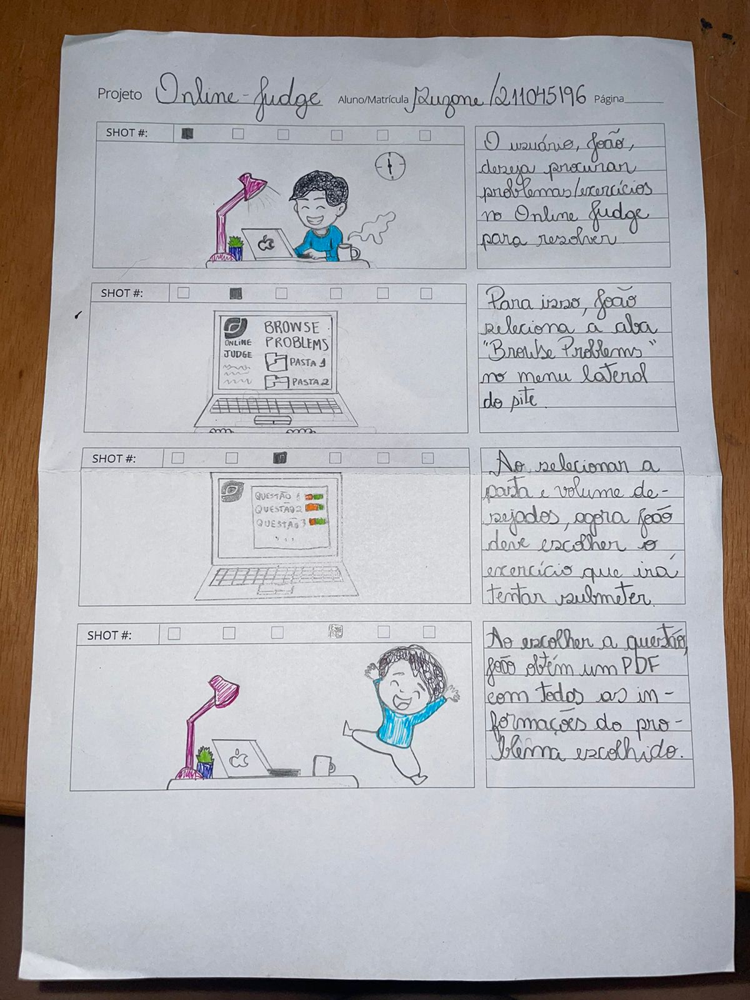
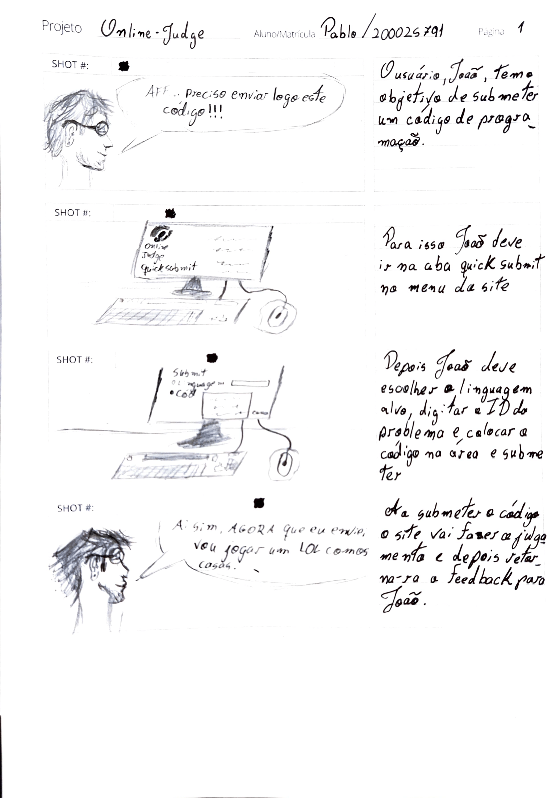
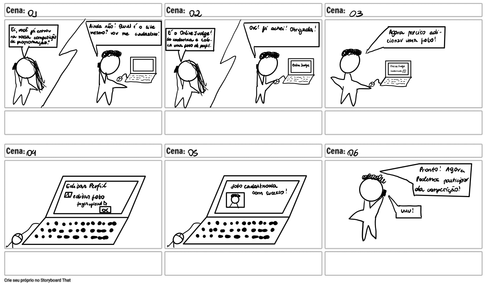

# Storyboards

## Introdução

Storyboards são documentos que podem ser usados em uma variedade de disciplinas, dedicados à narrativa visual como produções live action e animações, segundo Rousseau e Phillips<a id="anchor_1" href="#REF1">¹</a>. A combinação de seu propósito básico (que é contar uma história) e o seu método de apresentação (que é colar os desenhos em um quadro) gerou o termo storyboard. A partir desse conceito, é necessário destacar que um storyboard deve ter:

- Pessoas envolvidas;
- Ambiente/Contexto da situação;
- Tarefa a ser feita pelo usuário;
- Passos envolvidos para realizar a tarefa;
- O que motiva os usuários a usar o sistema;
- A satisfação da pessoa ao completar a tarefa.

A seguir são disponibilizados os protótipos que foram desenvolvidos pela equipe, com base nas tarefas definidas anteriormente em Análise de tarefas.

### **Procurar um problema**

Na figura 1, apresenta-se um storyboard no qual o usuário deseja procurar um novo problema no site.

Figura 1 - Storyboard procurar um problema.

<b>Fonte:</b> <a href="https://github.com/suzaneduarte">Suzane Duarte</a> </a>

### **Submeter problema (Quick Submit)**

Na figura 2, apresenta-se um storyboard no qual o usuário deseja submeter um problema para um problema encontrado no site.

Figura 2 - Storyboard submeter um problema.

<b>Fonte:</b> <a href="https://github.com/PabloGJBS">Pablo Guilherme</a> </a>

### **Contatar Colaboradores**

Na figura 3, apresenta-se um storyboard no qual o usuário deseja contatar colaboradores.

### **Editar Conta**

Na figura 4, apresenta-se um storyboard no qual o usuário deseja editar sua conta.

Figura 4 - Storyboard para editar conta.

<b>Fonte:</b> <a href="https://github.com/luanatorress">Luana Torres</a> </a>

### **Visualizar minhas submissões**

Na figura 5, apresenta-se um storyboard no qual o usuário deseja visualizar suas submissões.

### **Acessar o Contest System**

Na figura 6, apresenta-se um storyboard no qual o usuário deseja acessar o sistema de contests do site.

### **Acessar o "Forgot Login?" - Recuperação de login**

Na figura 7, apresenta-se um storyboard no qual o usuário deseja recuperar seu login no site.

## Referências bibliográficas

> <a id="REF1" href="#anchor_1">1.</a> Rousseau, D. H., & Phillips, B. R. (2013). Stoyboarding essentials. How to translate your stoy to the screen for film, TV, and other media. New York: Watson-Guptill Publishers. 

## Histórico de versões

| Versão | Data       | Descrição                           | Autor(es)                                                                                         | Revisor(es)                                     |
| ------ | ---------- | ----------------------------------- | ------------------------------------------------------------------------------------------------- | ----------------------------------------------- |
| 1.0    | 29/10/2023 | Criação e desenvolvimento da página | [Pablo Guilherme](https://github.com/PabloGJBS), [Suzane Duarte](https://github.com/suzaneduarte) | [Luana Torres](https://github.com/luanatorress) |
