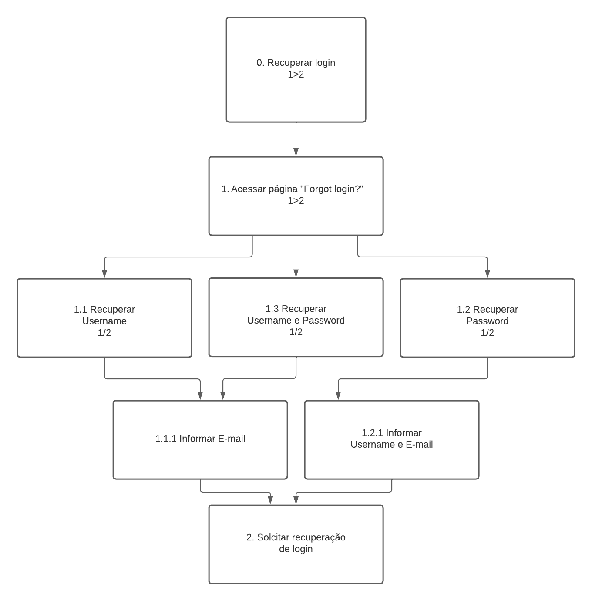

# Introdução - Análise de Tarefas

A análise de tarefas tem como finalidade proporcionar uma compreensão abrangente das atividades dos usuários, incluindo como as executam e os motivos por trás de suas ações. Nesse contexto, o trabalho é delineado em relação aos objetivos que os usuários buscam alcançar, seja por vontade própria ou por necessidade.

Dessa forma, para realizar a análise de tarefas deste projeto foram escolhidos dois métodos, sendo eles:

- Hierarchical Task Analysis (HTA);

- Goals, Operators, Methods and Selection Rules (GOMS);

# Análise Hierárquica de Tarefas

A análise Hierárquica de Tarefas (HTA - Hierarchical Task Analysis) visa compreender as competências e habilidades necessárias para a execução de tarefas complexas e não rotineiras, ao mesmo tempo que auxilia na detecção de problemas de desempenho. Ela facilita a conexão entre as ações das pessoas (ou o que é recomendado que façam), os motivos por trás dessas ações e as potenciais consequências de um desempenho inadequado.

Nessa técnica, é necessário identificar tarefas e objetivos. As tarefas referem-se a qualquer parte do trabalho que precisa ser realizado, enquanto o objetivo é um estado final específico definido por eventos ou valores observáveis em uma ou mais variáveis que atuam como critério de alcance do objetivo. Isto é, utiliza-se como base as tarefas a serem realizadas a fim de atingir um objetivo do usuário.

A listagem dessas tarefas precisa ser realizada com base nas propostas de notação textual e gráfica, conforme demonstrado na figura a seguir:

_Figura 1 - Exemplo de modelo HTA, adaptado de Barbosa & da Silva (2010)_

Essa notação, além de apresentar os objetivos também representa o conceito de operação, que é a representação das ações de entradas e saídas.

Abaixo é possível conferir as principais tarefas que um usuário procura utilizar através do Online Judge.

## Submeter problema (Quick Submit)

Nessa tarefa, o usuário possui o objetivo de submeter a solução de um determinado problema proposto. A Figura 2 apresenta o diagrama HTA relativa a essa tarefa, e a Tabela 1 representa o mesmo HTA em formato de tabela.

Figura 2 - Diagrama HTA para submissão de problemas.

<b>Fonte:</b> <a href="https://github.com/suzaneduarte">Suzane Duarte</a>, <a href="https://github.com/PabloGJBS">Pablo Guilherme</a>

Tabela 1 - HTA de submissão de problemas.

| Objetivo/Tarefa              | Descrição, Recomendações e Problemas                                                                                                                                                                                                        |
| ---------------------------- | ------------------------------------------------------------------------------------------------------------------------------------------------------------------------------------------------------------------------------------------- |
| 0. Submeter problema         |                                                                                                                                                                                                                                             |
| 1. Registrar uma conta       | **Input:** dados para o cadastro   **Feedback:** usuário visualiza mensagem para confirmar e-mail.   **Plano:** confirmar conta e depois fazer login                                                                                  |
| 1.1 Confirmar E-mail         | **Feedback:** após confirmar o e-mail, o usuário é liberado para realizar login                                                                                                                                                             |
| 1.2 Realizar login           | **Input:** dados de login  **Feedback:** usuário redirecionado para a página "Home"  **Plano:** abrir página de submissão em "Quick Submit"                                                                                           |
| 2. Acessar área de submissão | **Plano:** submeter a solução do problema                                                                                                                                                                                                   |
| 1.2 Identificar o problema   | **Input:** inserir ID do problema, linguagem utilizada e o referido código do problema  **Feedback:** a página é atualizada e o usuário recebe uma mensagem de submissão enviada  **Plano:** submeter a solução do problema escolhido |

<b>Fonte:</b> <a href="https://github.com/suzaneduarte">Suzane Duarte</a>, <a href="https://github.com/PabloGJBS">Pablo Guilherme</a>

## Procurar um problema

Nesta tarefa, o objetivo do usuário é buscar um novo problema para solucionar dentro do site. A Figura 3 apresenta o diagrama HTA relativa a essa tarefa, e a Tabela 2 representa o mesmo HTA em formato de tabela.

Figura 3 - Diagrama HTA para procurar problemas.

<b>Fonte:</b> <a href="https://github.com/suzaneduarte">Suzane Duarte</a>, <a href="https://github.com/PabloGJBS">Pablo Guilherme</a>

Tabela 2 - HTA de procurar um problema.

| Objetivo/Tarefa                            | Descrição, Recomendações e Problemas                                                                                                                                                                              |
| ------------------------------------------ | ----------------------------------------------------------------------------------------------------------------------------------------------------------------------------------------------------------------- |
| 0. Procurar problemas no Online Judge      | **Input:** click do usuário na aba "Browse Problems"   **Plano:** procurar um problema para resolver  **Feedback:** usuário redirecionado para a página com uma lista de pastas de problemas                |
| 1. Acessar pasta de problemas disponíveis  | **Input:** click do usuário na pasta escolhida  **Feedback:** usuário redirecionado para uma página contendo uma lista de pastas de problemas  **Plano:** escolher uma das pastas de problemas disponíveis  |
| 1.1 Escolher o volume do problema          | **Input:** click do usuário no volume escolhido  **FeedBack:** Usuário redirecionado para a página seguinte contendo os problemas de fato   **Plano:** visualizar um dos problemas desse determinado volume |
| 1.2 Escolher o problema a ser resolvido    | **Input:** click do usuário no problema  **FeedBack:** Usuário redirecionado para a página seguinte contendo a descrição do problema   **Plano:** ler todas as demais informações do problema               |
| 2. Obter informações do problema escolhido | **Plano:** através do PDF disponibilizado obter todas as informações necessárias para uma possível submissão                                                                                                      |

<b>Fonte:</b> <a href="https://github.com/suzaneduarte">Suzane Duarte</a>, <a href="https://github.com/PabloGJBS">Pablo Guilherme</a>
 -->

## Contatar Colaboradores

Nesta tarefa o usuario tem o objetvo de contatar, colaboradores do site, seja sobre o resultado de submissões, ou para relatar algum problema, ou dar alguma sugestão, a figura 4 apresenta o diagrama HTA relativo a essa funcionalidade e a tabela 3 a mesma em forma de tabela

Figura 4 - Diagrama HTA para contato com colaboradores.

<b>Fonte:</b> <a href="https://github.com/Ericcs10">Eric Camargo</a>

Tabela 3 - HTA de contato com colaboradores.

| Objetivo/Tarefa                          | Descrição, Recomendações e Problemas                                                                                   |
| ---------------------------------------- | ---------------------------------------------------------------------------------------------------------------------- |
| 0. Enviar mensagem para colaborador      | **Input:** click do usuário na aba "Contact us"                                                                     |
| 1. Inserir nome                          | **Input:** nome   **Feedback:** usuário é direcionado para o campo seguinte                                         |
| 2 Inserir E-mail do colaborador desajado | **Input:** email do colaborador  **Feedback:** após inserir o e-mail, o usuário é liberado para escrever a mensagem |
| 3 Escrever a Mensagem                    | **Input:** texto da mensagem  **Feedback:** usuário passa a ser capaz de enviar a mensagem                          |
| 4. Enviar                                | **Input:** enviar  **Feedback:** usuário recebe mensagem de sucesso na operação                                     |

<b>Fonte:</b> <a href="https://github.com/Ericcs10">Eric Camargo</a>

## Editar Conta

Nesta tarefa, o usuário tem como objetivo editar sua conta de usuário. A Figura 4 apresenta o diagrama HTA relativa a essa tarefa, e a Tabela 3 representa o mesmo HTA em formato de tabela.

Figura 5 - Diagrama HTA para edição de conta.

<b>Fonte:</b> <a href="https://github.com/luanatorress">Luana Torres</a>, <a href="https://github.com/esteerlino">Ester Lino</a>

 

Tabela 4 - HTA de edição de conta.

| Objetivo/Tarefa                          | Descrição, Recomendações e Problemas                                                                                                          |
| ---------------------------------------- | --------------------------------------------------------------------------------------------------------------------------------------------- |
| 0. Editar Conta                          | **Plano:** Editar meu usuário                                                                                                                 |
| 1. Atualizar imagem                      | **Plano:** atualizar foto de perfil                                                                                                           |
| 1.1. Editar Detalhes                     | **Plano:** atualizar foto de perfil                                                                                                           |
| 1.1.1. Imagem                            | **Plano:** atualizar foto de perfil                                                                                                           |
| 1.1.1.1. Não mudar imagem                | **Input:** update ou cancelar.  **Feedback:** usuário não visualiza nenhuma alteração.                                                  |
| 1.1.1.2. Carregar imagem                 | **Input:** imagem como foto de perfil.   **Feedback:** usuário visualiza imagem em seu perfil.                                          |
| 1.1.1.3. Selecionar Imagem da Galeria    | **Input:** click do usuário na biblioteca de imagens.   **Feedback:** usuário visualiza imagem escolhida da biblioteca em seu perfil.   |
| 1.1.2. Contato                           | **Plano:** atualizar detalhes de usuário.                                                                                                     |
| 1.1.2.1. Alterar detalhes do perfil      | **Input:** Dados de usuário que deseja ser modificado.   **Feedback:** usuário visualiza dados alterados.                               |
| 1.1.3. Adicionar Coordenadas Geográficas | **Input:** Dados de latitude e longitude.   **Feedback:** usuário visualiza dados alterados.                                            |
| 2. Atualizar Perfil                      | **Plano:** atualizar detalhes de usuário.                                                                                                     |

<b>Fonte:</b> <a href="https://github.com/luanatorress">Luana Torres</a>, <a href="https://github.com/esteerlino">Ester Flores</a>

## Visualizar minhas submissões

Nesta tarefa, o usuário tem como objetivo verificar as proprias subimissões de códigos. A Figura 6 apresenta o diagrama HTA relativa a essa tarefa, e a Tabela 5 representa o mesmo HTA em formato de tabela.

Figura 6 - Diagrama HTA para visualização de submissões.

<b>Fonte:</b> <a href="https://github.com/suzaneduarte">Suzane Duarte</a>, <a href="https://github.com/PabloGJBS">Pablo Guilherme</a>, <a href="https://github.com/henriqtorresl">Henrique Torres</a>

Tabela 5 - HTA de visualização de submissões.

| Objetivo/Tarefa                      | Descrição, Recomendações e Problemas                                                                                          |
| ------------------------------------ | ----------------------------------------------------------------------------------------------------------------------------- |
| 0. Visulizar minhas submissões       | _Plano:_ Visualizar minhas submissões no site                                                                                 |
| 1.1 Realizar login                   | _Input:_ dados de login  _Feedback:_ usuário redirecionado para a página "Home"  _Plano:_ abrir página "My submissions" |
| 2. Acessar área de minhas submissões | _Input:_ click do usuário na aba "My submissions"  _FeedBack:_ Usuário redirecionado para a página "My submissions"        |

<b>Fonte:</b> <a href="https://github.com/suzaneduarte">Suzane Duarte</a>, <a href="https://github.com/PabloGJBS">Pablo Guilherme</a>, <a href="https://github.com/henriqtorresl">Henrique Torres</a>

## Acessar o Contest System

Nesta tarefa, o usuário tem como objetivo de visualizar as competições/concursos que estão em execução, os próximos e os que já ocorreram. O diagrama HTA referente à essa tarefa está apresentado na Figura 7 e a Tabela 6 representa o mesmo HTA em formato de tabela.

Figura 7 - Diagrama HTA para visualização do Contest System.

<b>Fonte:</b> <a href="https://github.com/esteerlino">Ester Lino</a>, <a href="https://github.com/luanatorress">Luana Torres</a>

Tabela 6 - HTA de visualização do Contest System.

 Objetivo/Tarefa | Descrição, Recomendações e Problemas|
| ------------------------------ | -------------------------------------- |
|0. Acessar o Contest System | **Input:** click do usuário na aba "Contests".  |
|1. Acessar a aba "Contests | **Input:** click do usuário em uma das quatro opções disponíveis.  **Feedback:** usuário redirecionado para a página escolhida. |
|2. Running contest |**Input:** click do usuário na aba "Running contests". **FeedBack:** usuário redirecionado para a página desejada.  |
|2.1 Visualizar concursos em execução| **Plano:** ter acesso a todos os concursos em andamento.|
|2.2 Resolver os problemas propostos|**Input:** click do usuário no concurso que está inscrito.  **FeedBack:** usuário redirecionado para a página com os problemas do concurso  **Plano:** realizar os exercícios do concurso.|
|3. Coming contests|**Input:** click do usuário na aba "Coming contests"   **FeedBack:** usuário redirecionado para a página desejada.  |
|3.1. Visualizar concursos futuros | **Plano:** ter acesso a todos os concursos futuros. |
|3.2 Se increver em um concurso| **Input:** click do usuário no concurso que ele deseja se increver.  **Feedback:** usuário redirecionado para a página de incrição. |
|4. Past contests|**Input:** click do usuário na aba "Past contests"   **FeedBack:** usuário redirecionado para a página desejada.  |
|4.1. Visualizar concursos passados | **Plano:** ter acesso a todos os concursos passados. |
|4.2 Acessar área de detalhes sobre o concurso.| **Input:** click do usuário no concurso que ele deseja se visualizar.  **Feedback:** usuário redirecionado para a página de visualização dos detalhes do concurso. |
|5. Contest ranking|**Input:** click do usuário na aba "Contest ranking"   **FeedBack:** usuário redirecionado para a página desejada.  |
|5.1. Acessar área com o ranking dos participantes | **Plano:** ter acesso às informações dos participantes do s concursos. |

## Acessar o "Forgot Login?" - Recuperação de login

Nessa tarefa, o usuário tem como objetivo recuperar a senha ou o nome de usuário esquecido, para que possa acessar o sistema. A Figura 8 apresenta o diagrama HTA relativa a essa tarefa, e a Tabela 7 representa o mesmo HTA em formato de tabela.

Figura 7 - Diagrama HTA para visualização do sistema "Forgot login?".

<b>Fonte:</b> <a href="https://github.com/kalipassos">Kallyne Macedo</a>

 Tabela 1 - HTA de recuperação de login.

| Objetivo/Tarefa | Descrição, Recomendações e Problemas|
| ------------------------------ | -------------------------------------- |
| 0. Recuperar login | |
| 1. Acessar página "Forgot login?" | **Input :** click do usuário na aba "Forgot login?"   **Plano :** Encontrar página para recuperação de senha.  **Feedback :** usuário redirecionado para a página de recuperação de login.|
| 1.1 Recuperar Username | **Input:** click do usuário na checkbox Lost Username  **Plano:** Solicitar recuperação de username por email  **Feedback:** Aparecer campo de preenchimento de e - mail |
| 1.1.1 Informar E - mail | **Input:** click do usuário para digitar e - mail   **Plano:** Enviar e - mail para recuperar username  **Feedback:** E - mail enviado com sucesso |
| 1.2 Recuperar Password | **Input:** click do usuário na checkbox Lost Password  **Plano:** Solicitar recuperação de senha por email  **Feedback :** Aparecer campo de preenchimento de e - mail e username |
| 1.2.1 Informar Username e E - mail | **Input :** click do usuário para digitar username e - mail  **Plano:** Enviar e - mail para recuperar username e password  **Feedback:** E - mail enviado com sucesso |
| 1.3 Recuperar Username e Password | **Input:** click do usuário na checkbox Lost Password e Lost Username  **Plano:** Solicitar recuperação de username e senha por email  **Feedback:** Aparecer campo de preenchimento de e - mail |
| 2. Solicitar recuperação de login | **Input:** click do usuário no botão Send Username/Password   **Plano:**  envio das informações de login por e-mail   **Feedback:** envio realizado com sucesso. |  |

<b> Fonte: </b><a href = "https://github.com/kalipassos"> Kallyne Macedo</a>

# Bibliografia

> BARBOSA, S. D. J.; SILVA, B. S. Interação Humano-Computador. Rio de Janeiro: Elsevier, 2011.

# Histórico de versão

| Versão |    Data    |                         Descrição                          |                                             Responsáveis                                              |                     Revisor                     |
| :----: | :--------: | :--------------------------------------------------------: | :---------------------------------------------------------------------------------------------------: | :---------------------------------------------: |
|  1.0   | 01/10/2023 |              Introdução a Análise de Tarefas               |   [Suzane Duarte](https://github.com/suzaneduarte), [Pablo Guilherme](https://github.com/PabloGJBS)   | [Kallyne Macedo](https://github.com/kalipassos) |
|  1.1   | 16/10/2023 | Adicionando análise de tarefa Visualizar minhas submissões | [Suzane Duarte](https://github.com/suzaneduarte), [Henrique Torres](https://github.com/henriqtorresl) | [Pablo Guilherme](https://github.com/PabloGJBS) |
|  1.2   | 16/10/2023 | Adicionando análise de tarefa acessar Contest System e editar perfil | [Ester Lino](https://github.com/esteerlino),[Luana Torres](https://github.com/luanatorress) | [Suzane Duarte](https://github.com/suzaneduarte) |
|  1.3   | 16/10/2023 | Adicionando análise de tarefa acessar Forgot Login? | [Kallyne Macedo](https://github.com/kalipassos) | [Suzane Duarte](https://github.com/suzaneduarte) |
