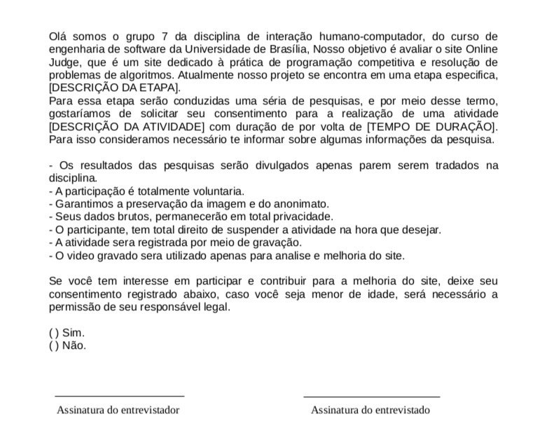

## Introdução

Em uma pesquisa eticamente justificável é dever da equipe de design proteger o bem-estar físico e psicológico dos participantes. 
O pesquisador deve explicar os objetivos da pesquisa, garantir a confidencialidade e a privacidade dos participantes, assim como, o anonimato destes ao divulgar a pesquisa.
Através da [resolução nº 466/2012](./reso466.pdf) do Conselho Nacional de Saúde<a id="anchor_1" href="#REF1">^1^</a> regida no Brasil, o avaliador é orientado a lidar com as questões éticas de pesquisa envolvendo os seguintes princípios:

- Princípio da autonomia: envolve o consentimento livre e esclarecido dos indivíduos e a proteção de grupos vulneráveis e legalmente incapazes, como menores de idade, alunos ou subordinados. Em pesquisas envolvendo seres humanos, é importante tratá-los com dignidade, respeitá-los em sua autonomia e defendê-los em sua vulnerabilidade.
- Princípio da beneficência: requer uma ponderação cuidadosa entre riscos e benefícios, tanto presentes quanto potenciais, individuais ou coletivos. É necessário comprometer-se com o máximo de benefícios e o mínimo de danos e riscos. Esses danos podem ocorrer em várias dimensões da vida humana, como física, psíquica, moral, intelectual, social, cultural ou espiritual, tanto durante a pesquisa quanto após ela.
- Princípio da não maleficência: busca garantir que danos previsíveis relacionados à pesquisa sejam evitados, tanto imediatos quanto tardios.
- Princípio da justiça e equidade: está relacionado à relevância social da pesquisa, buscando vantagens significativas para os participantes e minimização do ônus para aqueles que são vulneráveis. É importante garantir a igual consideração dos interesses envolvidos em todas as etapas da pesquisa.

## Termo de Consentimento

A participação na pesquisa deve ocorrer apenas com o consentimento livre e esclarecido dos participantes. Através do termo de consentimento são comunicadas aos participantes todas as informações pertinentes da pesquisa de modo a garantir a a decisão livre e consciente na participação desta. Como por exemplo, se necessário utilizar gravação de voz ou imagem do participante, faz-se necessário obter a permissão para gravar. Também é importante enfatizar que o participante tem o direito e liberdade de se recusar a participar ou retirar seu consentimento e abandonar o estudo em qualquer fase da pesquisa.
Nesta disciplina, quando se trata de pesquisas envolvendo pessoas, o grupo utiliza-se deste de termo de consentimento presente na Figura 1 quando for necessário:

Figura 1 - Termo de Consentimento.

<b>Fonte:</b> <a href="https://github.com/luanatorress">Luana Torres</a>, <a href="https://github.com/ericcs10">Eric Camargo</a>

 

## Referências Bibliográficas

> <a id="REF1" href="#anchor_1">1.</a> BRASIL. Resolução nº 466, de 12 de dezembro de 2012, que trata de pesquisas em seres humanos e atualiza a resolução 196. Brasília, DF: Diário Oficial da União, 2013. Disponível em: <<https://conselho.saude.gov.br/resolucoes/2012/Reso466.pdf>>. Acesso em: 14/10/2023.

## Bibliografia

>1. Aspectos Éticos Bilheteria Digital. Disponível em: <<https://interacao-humano-computador.github.io/2023.1-BilheteriaDigital/>>. Acesso em 14 de outubro de 2023.

>2. BARBOSA, Simone; SILVA, Bruno. Interação humano-computador. Elsevier Brasil, 2010.>>

## Histórico de Versões

| Versão | Data       | Descrição                                       | Autor(es)                                                                                     | Revisor(es)                                      |
| ------ | ---------- | ----------------------------------------------- | --------------------------------------------------------------------------------------------- | ------------------------------------------------ |
| 1.0  | 14/10/2023 | Criação da página da página de aspectos éticos. | [Luana Torres](https://github.com/luanatorress), [Eric Camargo](https://github.com/ericcs10) | [Ester Flores](https://github.com/esteerlino), [Kallyne Macedo](https://github.com/kalipassos) |