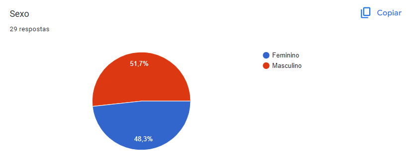
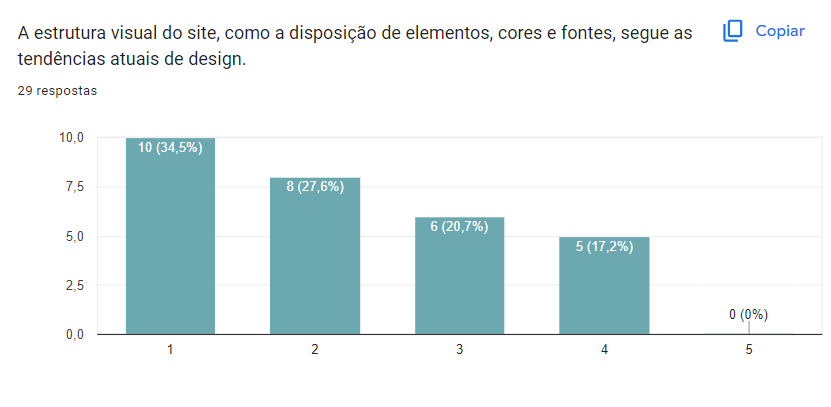
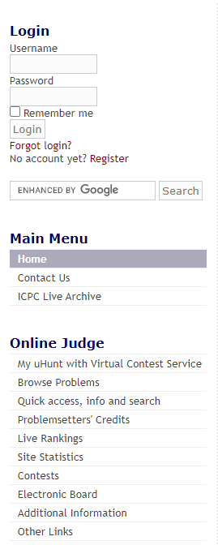
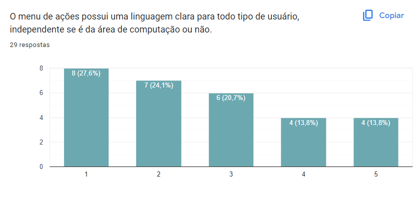
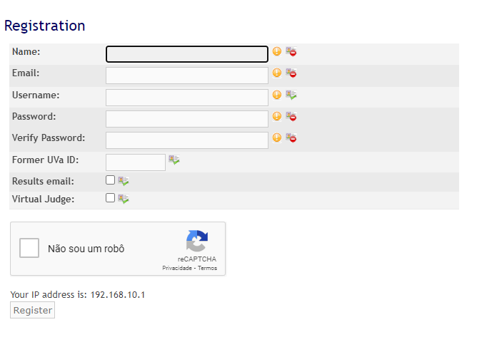
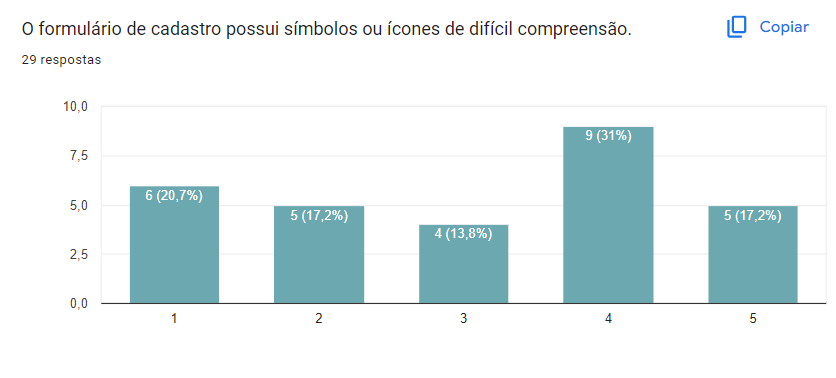
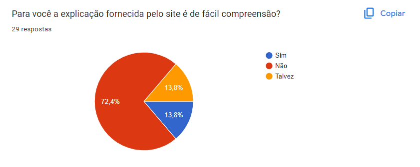

# **Perfil de Usuário**

## Introdução

Definir o perfil de usuário é uma etapa essencial no desenvolvimento do projeto, visto que possibilita compreender quem são os indivíduos que utilizam o sistema. Segundo Barbosa e Silva, esse perfil descreve as características dos usuários, possibilitando entender quais são os objetivos que o sistema deve atender ao ser projetado. Essa abordagem auxilia no entendimento das necessidades, preferências e requisitos dos usuários, contribuindo para o desenvolvimento de um sistema mais eficaz e voltado para atender às suas demandas. <a id="anchor_1" href="#REF1">1</a>.

## Objetivo

O artefato presente busca, através do uso de metodologias específicas de pesquisa, estudar o público-alvo da plataforma avaliada para que seja definido os atributos do perfil, ou dos perfis, de usuário que devem ser considerados em todas as propostas, sugestões e decisões que serão levantadas no desenvolvimento do projeto.

## Metodologia

Para a elaboração do perfil de usuário foram utilizadas duas técnicas: questionário e entrevista. O questionário foi elaborado no Google Forms e possuía 15 questões que incluiam dados demográficos e informações sobre a experiência do usuário ao utilizar o site. O formulário coletou respostas durante os dias 13/10/2023 e 15/10/2023. No artefato de Aspectos Éticos é apresentado o Termo de Consentimento. A entrevista, conduzida pela integrante [Kallyne Macedo](https://github.com/kalipassos), foi realizada, em momentos distintos através da ferramenta de vídeo-chamada da plataforma WhatsApp, com três estudantes universitários de Engenharia de Software na Universidade de Brasília (UnB), do sexo masculino, identificados como E1, E2 e E3 (Entrevistado 1, 2 e 3) e contava com 6 perguntas sobre a experiência com sites de juiz online e com o Online Judge.

## Dados coletados pelo questionário

**Pergunta 1:** Como você classifica sua experiência com programação? 
Ao analisar a Figura 1 é possível concluir que 44,6% possuem certa experiência na área de programação.

 <figcaption align="center">Figura 1 - Respostas da 1ª pergunta.</figcaption>

<figcaption align="center">Autores: Página de resultados do Google Forms</figcaption> 

**Pergunta 2:** Você já utilizou algum site de juíz online para praticar programação? 
A Figura 2 mostra que 69% dos participantes do questionário já utilizaram sites de juiz online para treinar programação.

 <figcaption align="center">Figura 2 - Respostas da 2ª pergunta.</figcaption>

<figcaption align="center">Autores: Página de resultados do Google Forms</figcaption> 

**Pergunta 3:** Você já utilizou especificamente o site Online Judge para praticar programação? 
De acordo com a Figura 3, cerca de 89,7% dos participnates nunca usaram o Online Judge.

 <figcaption align="center">Figura 3 - Respostas da 3ª pergunta.</figcaption>

<figcaption align="center">Autores: Página de resultados do Google Forms</figcaption> 

**Pergunta 4:** Qual a sua idade? 
93,1% dos participantes estão entre a faixa etária de 19-24 anos de idade.

 <figcaption align="center">Figura 4 - Respostas da 4ª pergunta.</figcaption>

<figcaption align="center">Autores: Página de resultados do Google Forms</figcaption> 

**Pergunta 5:** Sexo 
A quantidade de participantes do sexo feminino foi de 48,3% e do sexo masculino 51,7% (Figura 5).
 <figcaption align="center">Figura 5 - Respostas da 5ª pergunta.</figcaption>

<figcaption align="center">Autores: Página de resultados do Google Forms</figcaption> 

**Pergunta 6:** Qual o seu grau de escolaridade? 
Cerca de 79,3% dos participantes possuem Ensino Superior Incompleto (Figura 6).

 <figcaption align="center">Figura 6 - Respostas da 6ª pergunta.</figcaption>

<figcaption align="center">Autores: Página de resultados do Google Forms</figcaption> 

**As perguntas 7, 8 e 9 se basearam na Figura 7, a qual mostra a tela inicial do site Online Judge.**

 <figcaption align="center">Figura 7 - Tela inicial do Online Judge.</figcaption>

<figcaption align="center">Autores: Página inicial do Online Judge.</figcaption> 

**Pergunta 7:** Ao acessar a tela inicial do site, há muitas informações ou propagandas que podem tornar a página confusa ou sobrecarregada. 
37,9% dos participantes concordaram totalmente com essa afirmação, de acordo com a Figura 8.

 <figcaption align="center">Figura 8 - Respostas da 7ª pergunta.</figcaption>

<figcaption align="center">Autores: Página de resultados do Google Forms</figcaption> 

**Pergunta 8:** A estrutura visual do site, como a disposição de elementos, cores e fontes, segue as tendências atuais de design. 
10 dos 29 participantes do questionário, discordaram totalmente dessa afirmação (Figura 9).

 <figcaption align="center">Figura 9 - Respostas da 8ª pergunta.</figcaption>

<figcaption align="center">Autores: Página de resultados do Google Forms</figcaption> 

**Pergunta 9:** A tela inicial fornece informações relevantes de forma clara, facilitando ao usuário encontrar determinada tarefa.
Por exemplo: realizar o cadastro no site. 
Cerca de 27,6% dos participantes tiveram uma opinião neutra sobre essa afirmação (Figura 10).

 <figcaption align="center">Figura 10 - Respostas da 9ª pergunta.</figcaption>

<figcaption align="center">Autores: Página de resultados do Google Forms</figcaption> 

**A pergunta 10 se baseia na Figura 11, que mostra o menu de ações do site Online Judge.**

 <figcaption align="center">Figura 11 - Menu de ações e ferramentas do Online Judge.</figcaption>

<figcaption align="center">Autores: Menu do Online Judge.</figcaption> 

**Pergunta 10:** O menu de ações possui uma linguagem clara para todo tipo de usuário, independente se é da área de computação ou não. 
27,6% discordaram totalmente dessa afirmação (Figura 12).

 <figcaption align="center">Figura 12 - Respostas da 10ª pergunta.</figcaption>

<figcaption align="center">Autores: Página de resultados do Google Forms</figcaption> 

**As perguntas 11, 12 e 13 se baseiam na Figura 13, que mostra a tela de registro do site Online Judge.**

 <figcaption align="center">Figura 13 - Tela de registro do Online Judge.</figcaption>

<figcaption align="center">Autores: Tela de registro do Online Judge.</figcaption> 

**Pergunta 11:** O formulário de cadastro possui símbolos ou ícones de difícil compreensão. 
31% dos participantes concordaram com a afirmação da pergunta 11 (Figura 14).

 <figcaption align="center">Figura 14 - Respostas da 11ª pergunta.</figcaption>

<figcaption align="center">Autores: Página de resultados do Google Forms</figcaption> 

**Pergunta 12:** O formulário de cadastro forneceu informações claras sobre quais campos eram obrigatórios e quais eram opcionais. 
31% dos participantes tiveram uma opnião neutra sobre a afirmação da pergunta 12 (Figura 15).

 <figcaption align="center">Figura 15 - Respostas da 12ª pergunta.</figcaption>

<figcaption align="center">Autores: Página de resultados do Google Forms</figcaption> 

**Pergunta 13:** O site explica adequadamente o significado de termos e símbolos. 
31% dos participantes discordaram totalmente da afirmação da pergunta 13 (Figura 16).

 <figcaption align="center">Figura 16 - Respostas da 13ª pergunta.</figcaption>

<figcaption align="center">Autores: Página de resultados do Google Forms</figcaption> 

**A pergunta 14 se baseia na Figura 17, que o campo Former UVa ID presente na tela de cadastro do site Online Judge.**

 <figcaption align="center">Figura 17 - Campo Former UVa ID.</figcaption>

<figcaption align="center">Autores: Campo Former UVa ID (Online Judge).</figcaption> 

**Pergunta 14:** Para você a explicação fornecida pelo site é de fácil compreensão? 
> Tradução do texto presente na Figura 17: Antigo UVa ID: O ID (incluindo o check de 2 letras) que você está usando atualmente no sistema UVa Online Judge.  Usar &#39;00000&#39;  se você não tiver um.  As informações serão usadas em um futuro próximo para migrar suas submissões.  Isso não pode ser modificado após o registro, então, por favor, seja preciso.

72,4% afirmaram que a explicação do site para o campo Former UVa Id não é de fácil compreensão.

 <figcaption align="center">Figura 18 - Respostas da 14ª pergunta.</figcaption>

<figcaption align="center">Autores: Página de resultados do Google Forms</figcaption> 

**Pergunta 15:** Você tem algum comentário sobre sua experiência com o site Online Judge ou alguma sugestão de melhoria? 
Essa pergunta era opcional e tivemos duas respostas: "Não" e "Eu não usei, mas as imagens mostram algo ruim" (Figura 19).

 <figcaption align="center">Figura 19 - Respostas da 15ª pergunta.</figcaption>

<figcaption align="center">Autores: Página de resultados do Google Forms</figcaption> 

## Dados coletados pela entrevista

**Pergunta 1:** Como você classifica sua experiência com programação? E computação? 
**E1:** Experiente. 
**E2:** Dentro do escopo da faculdade eu considero média/alta, pois já fiz grande parte das matérias de programação que a universidade oferece e me inseri em diversas iniciativas. E média/alta para computação também pelos mesmos motivos. 
**E3:** Experiência média com programação, não programando com muita frequência. Com computação, baixa. 

**Pergunta 2:** Que afinidade você tem com sites de júri online? 
**E1:** Já utilizei bastante na faculdade, mas não utilizo para estudo próprio. 
**E2:** Alta, eu utilizei ele em praticamente todas as matérias de programação até o presente momento. 
**E3:** Utilizei poucas vezes para atividades da faculdade. 

**Pergunta 3:** Qual sua primeira impressão do site OnlineJudge? Como ele se compara com outros sites de júri online que você conhece? 
**E1:** Minha primeira impressão é que ele é bem velho e não tem uma interface intuitiva. Comparado a outros sites de juri online, o OnlineJudge fica atrás em quesitos de UI/UX. 
**E2:** Ele é bem criterioso e muitas vezes leva em consideração alguns fatores que nem sempre são levados por outros juízes convencionais como o do URI on-line judge.  
**E3:** Não gostei da interface. É estranho a notícia dos livros na página inicial. Os outros sites que conheço são mais modernos. 

**Pergunta 4:** Notou algum erro ou ponto de destaque no site? 
**E1:** O Site não tem um cabeçalho.  
**E2:** O design dele é bem defasado e poderia ter algumas funcionalidades extras para orientar os alunos sobre o erro obtido.  
**E3:** Login meio escondido, do lado esquerdo; Coluna de 'sponsors' sem preencher (--your name here--); Ter anúncios na página inicial, invés de uma introdução, é confuso para o usuário. 

**Pergunta 5:** Que tarefas você realiza na página inicial do site? 
**E1:** Login, cadastro, recuperar senha, acesso a livros, doar para os mantenedores do site. 
**E2:** Login, acesso de lista, verificação de prazos das listas. 
**E3:** Login, pesquisar no google. 

**Pergunta 6:** O que você mudaria no site? 
**E1:** Majoritariamente eu mudaria a interface. Ela está muito ultrapassada e não atende a muitos padrões de qualidade. 
**E2:** O design pensando na usabilidade e também a questão de não conseguirmos verificar os erros obtidos e ficarmos dependentes de um bot de uma plataforma externa 
**E3:** Deixaria mais claro o intuito do site para ficar mais fácil o primeiro acesso e a curva de aprendizagem. 

## Conclusão

Após a coleta e os estudos dos dados obtidos com o questionário e as entrevistas, é possível traçar um perfil objetivo para o usuário do site Online Judge. Dessa forma, observamos que o perfil majoritário de uso é de público misto (48% feminino e 52% masculino), entre 19 a 24 anos de idade, com escolaridade de Ensino Superior Incompleto, o que indica perfil universitário. A entrevista, conduzida com três alunos encaixados no perfil traçado para o público-alvo, possibilitou a visualização de diferentes pontos de atenção levantados acerca do site e identificou o usuário como apto e adaptado com o uso de tecnologia computacional. Assim, podemos definir os atributos do usuário: 
**• 1 - Idade:** Jovem 
**• 2 - Experiência:** Intermediário à Especialista 
**• 3 - Atitudes:** Tecnófilos 
**• 4 - Tarefas Primárias:** Atividade acadêmica sem fins lucrativos.  

## Referências Bibliográficas

> <a id="REF1" href="#anchor_1">1.</a> BARBOSA, S. D. J.; SILVA, B. S. Interação Humano-Computador. Rio de Janeiro: Elsevier, 2011.

## Histórico de versão

| Versão |    Data    |                  Descrição                   |         Responsáveis          |    Revisor    |
| :----: | :--------: | :------------------------------------------: | :---------------------------: | :-----------: |
|  1.0   | 15/10/2023 | Inicialização da página de perfil de usuário | [Ester Lino](https://github.com/esteerlino) | [Luana Torres](https://github.com/luanatorress) |
| 1.1    | 16/10/2023 | Entrevistas e conclusão | [Kallyne Macedo](https://github.com/kalipassos) | [Ester Lino](https://github.com/esteerlino) |
| 1.2    | 06/12/2023 | Correção pós verificação | [Kallyne Macedo](https://github.com/kalipassos) | [Ester Lino](https://github.com/esteerlino) |
