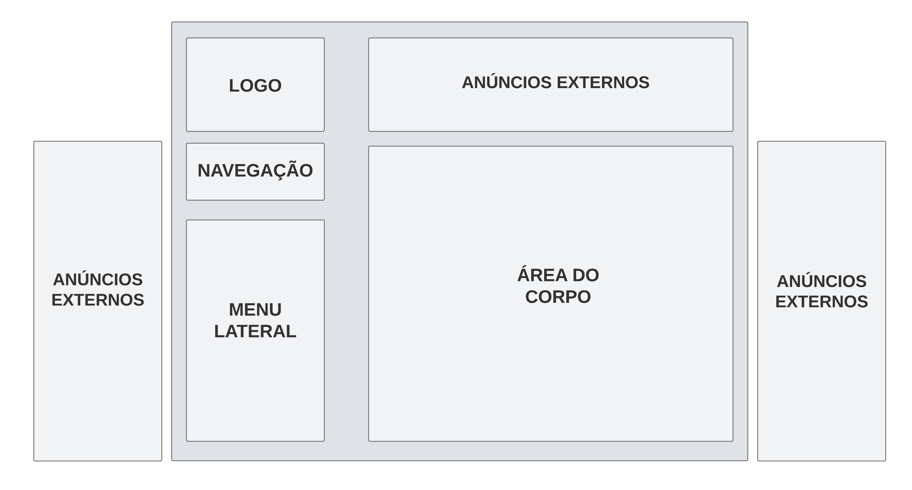

# _Guia de Estilo_

## 1. Introdução

O Guia de Estilo foi concebido de maneira a ser um guia de referência sobre a seleção e configuração de objetos de interação. Sendo assim, ele funciona como um registro das principais decisões de design, de forma que elas possam ser prontamente acessadas e aplicadas em discussões sobre possíveis expansões ou futuras versões do produto.

## 1.1 Objetivo, Organização e Conteúdo do guia de estilo

#### 1.1.1 OBJETIVO DO GUIA DE ESTILO

Este documento tem como finalidade a análise do estado pré-intervenção do design da interface do Online Judge. Após a compreensão dos princípios fundamentais que regem essa interface, o documento pretende servir como uma ferramenta de comunicação entre os membros da equipe de design e a equipe de desenvolvimento do produto final. Por fim, ele também é utilizado na implementação de fases intermediárias, como por exmeplo a prototipação.

#### 1.1.2 ORGANIZAÇÃO DO GUIA DE ESTILO

A organização desse guia de estilo seguirá a proposta estabelecida por Marcus<a id="anchor_1" href="#l1">¹</a> e Mayhew<a id="anchor_2" href="#l1">²</a>, a qual pode ser encontrada em Barbosa<a id="anchor_3" href="#l1">³</a>. Sendo ela:

- Introdução
- Resultados de análise
- Elementos de interface
- Elementos de interação
- Elementos de ação
- Vocabulário e Padrões
- Propostas de Intervenção

#### 1.1.3 PÚBLICO-ALVO DO GUIA DE ESTILO

Este guia de estilo foi criado a priori com o propósito de atender às necessidades de dois grupos principais: os estudantes da disciplina de Interação Humano-Computador envolvidos no projeto do Online Judge, e também a equipe de design do Online Judge que por ventura possam ter interesse no artefato.

#### 1.1.4 COMO UTILIZAR O GUIA DE ESTILO

Este guia de estilo se apresenta como um registro das principais decisões de design tomadas, de forma que elas não se percam, isto é, sejam efetivamente incorporadas no produto final. É importante que as decisões de design possam ser facilmente consultadas e reutilizadas nas discussões sobre extensões ou versões futuras do produto. Deste modo, este documento reune os princípios e as diretrizes adotados pelo site Online Judge.

#### 1.1.5 COMO MANTER O GUIA DE ESTILO

O guia de estilo é um artefato em constante evolução, a qual demanda uma manutenção regular para assegurar sua pertinência e eficácia contínuas. É essencial manter o guia atualizado e alinhado com o progresso do projeto, bem como com novas descobertas e entendimentos adquiridos ao longo do desenvolvimento e das interações com os usuários. Sendo assim, para garantir o que foi dito anteriormente, adotaremos práticas como atualizações regulares, utilização de práticas de versionamento e controle de alterações.

## 2. Resultados da Análise e Metodologia utilizada

#### 2.1 DESCRIÇÃO DO AMBIENTE DE TRABALHO DO USUÁRIO

A plataforma Online Judge é utilizada principalmente através de computadores. Isso porque, para realizar a submissão dos problemas é necessário que o código tenha passado pelo processo de compilação, ao qual infere-se que geralmente não é efetuado por dispositivos móveis. Dessa maneira, apesar dos usuários conseguirem acessar o site através do celular, é crucial dar destaque às particularidades dos dispositivos web durante o processo de design e desenvolvimento da interface do sistema. De forma a assegurar que ela proporcione uma experiência de usuário satisfatória e eficaz para aqueles que acessam a plataforma, envolvendo desde a adaptação de uma interface minimalista para diferentes tamanhos de tela, até a seleção de elementos visuais adequados.

## 3. Elementos de interface

#### 3.1 DISPOSIÇÃO ESPACIAL E GRID

O estilo de layout do Online Judge leva em consideração uma divisão em sessões, aos quais estão centralizados. A seguir, na Figura 1 é possível visualizar a disposição dos elementos da página principal do sistema.

Figura 1: Disposição dos elementos da página inicial

(Fonte: <a href="https://github.com/suzaneduarte">Suzane Duarte</a>) 

#### 3.2 JANELAS

O site oferece inúmeras janelas de navegação ao usuário, porém, pode-se destacar as principais, como a página inicial, a página de submissão de problemas e também a página para procurar novos problemas. As páginas citadas podem ser visualizadas a seguir respectivamente na Figura 2, Figura 3 e Figura 4.

Figura 2: Janela inicial

(Fonte: <a href="https://onlinejudge.org/">Online Judge, 2023</a>) 

Figura 3: Janela de submissão de problemas

(Fonte: <a href="https://onlinejudge.org/">Online Judge, 2023</a>) 

Figura 4: Janela para procurar problemas

(Fonte: <a href="https://onlinejudge.org/">Online Judge, 2023</a>) 

#### 3.3 TIPOGRAFIA

A fonte predominante no OnlineJudge é a Verdana. No entanto, muitos editores de sites desaconselham seu uso pois o tamanho da fonte pode não se alinhar bem com outras fontes usadas no site, o que ocorre de fato acontece no caso do OnlineJudge que também utiliza outras fontes como Helvetica, Arial, Sans-Serif. Dessa forma, sugerimos a utilização da Helvetica, por sua simplicidade, clareza e legibilidade, o que a torna uma escolha popular para uma variedade de aplicações, incluindo impressão, design de logotipos, design de embalagens e web design.

Figura 5: exemplo de diferentes fontes

  

(Fonte: <a href="https://onlinejudge.org/">Online Judge, 2023</a>) 

#### 3.4 CORES

O logo do site está em #0055FE. Já entre os tópicos o site possui diferenças de cores entre os títulos e subtítulos, entre os títulos há a predominância da cor #000066 e nos subtítulos a cor #660000. Por fim, a maioria dos hyperlinks estão em #990000, e a parte de fundo #D3D3D3.

Figura 6: Exemplo de cores

  

(Fonte: <a href="https://github.com/Ericcs10"> Eric Camargo</a>)

#### 3.5 ANIMAÇÕES

O site não possui nenhum elemento que possui animação.

## 4. Elementos de interação

#### 4.1 ESTILOS DE INTERAÇÃO

Os usuários interagem com o site ao clicar em hiperlinks ou botões que contêm elementos de texto. Esses elementos tipográficos, como palavras ou frases clicáveis, permitem que os usuários naveguem pelo site, acessem informações ou realizem ações específicas ao simplesmente clicar neles. Essas ações são a maneira principal pela qual os visitantes do site se deslocam e engajam com o conteúdo e funcionalidades oferecidos.

#### 4.2 SELEÇÃO DE UM ESTILO

O estilo escolhido foi planejado com o objetivo de tornar a interface do sistema intuitiva e amigável para os usuários, ao mesmo tempo em que garante que as maneiras de interagir com o sistema sejam uniformes e coerentes em toda a plataforma. Isso significa que os usuários podem se sentir à vontade ao utilizar o sistema e encontrarão uma experiência consistente em todas as áreas.

#### 4.3 ACELERADORES (teclas de atalho)

O site apresenta duas colunas com a presença de atalhos, a primeira coluna "Main Menu" possui três botões, sendo eles: "Home" que direciona a pagina inicial, "Contact Us" que leva a tela de contato com colaboradores, e "ICPC Live Archive" que não funciona como atalho e sim como hyperlink. A outra coluna posicionada logo abaixo da "Home" é a "Online Judge" que possui os botões para os principais caminhos do sistema, porem apenas alguns funcionam como atalhos, outros são hyperlinks, os de atalho são: "Browse problems" que serve para ir para a tela de pesquisar por questões. "Problemsetter's Credits" que é para vizualizar os criadores das questões. "Site Statistics" esse atalho abre um outro menu de atalhos logo abaixo o botão principal, todos eles levam a dados do site relacionados as questões e seus autores. "Contests" esse atalho tambem disponibiliza um novo menu abaixo da tecla, todas as opções são relacionadas as questões submetidas pelo usuário. "Eletronic Board" essa tecla apresentou "ERROR 502 Bad Gateway" e não foi possivel visualizar seu destino. "Additional Information" Abre um menu onde pelas opções é possivel visualizar a legenda dos codigos que o sistema retorna para o usuario após a submissão de questões, e especificações de submissão. O site não deixa claro a diferença entre o que são hyperlinks e o que são atalhos.

Figura 7: exemplo de atalho

  

(Fonte: <a href="https://onlinejudge.org/">Online Judge, 2023</a>)

## 5. Elementos de ação

#### 5.1 PREENCHIMENTO DE CAMPOS

Os campos presentes no sistema são preencidos manualmente pelo usuário, não possuí nenhum tipo de preenchimento automatico, "Login", "Senha" e "Enter your message" são exemplos de campos preenchidos por digitação manual.

#### 5.2 SELEÇÃO

O site possui alguns elementos de seleção alguns exemplos são, Problemas: Você pode selecionar problemas específicos para resolver a partir de uma lista de problemas disponíveis.Envio de Soluções: Após escolher um problema, você pode enviar uma solução para ele. Isso envolve selecionar a linguagem de programação que você deseja usar para sua solução. Status: Você pode verificar o status de suas submissões, como se sua solução foi aceita ou não, ou se houve algum erro. Ranqueamento: O site geralmente fornece informações sobre a classificação dos usuários com base no número de problemas resolvidos e outros critérios. Procurar Problemas: Há uma opção de pesquisa que permite procurar problemas com base em palavras-chave ou outros critérios. Perfil de Usuário: Você pode acessar seu perfil de usuário para ver estatísticas, conquistas e outras informações relacionadas às suas atividades no site. Fórum: O site pode incluir um fórum onde os usuários podem discutir problemas, compartilhar dicas e tirar dúvidas.

#### 5.3 ATIVAÇÃO

Gerados por hyperlinks ou botões de ação.

## 6. Vocabulário e Padrões

#### 6.1 TERMINOLOGIA

As terminologias encontradas são padrões tendo como referência ambientes de programação competitiva, como por exemplo. "Submission", "Accepted", "Time Limit", "Memory Limit".

#### 6.2 TIPOS DE TELA

O site possui uma sidebar ao lado esquerdo onde se encontra a logo do OnlineJudge, o espaço de login, as duas tabelas de atalho, "Main Menu" e "Online Judge" que sao fixas e aparecem em todas as telas. Os tipos de tela variam de acordo com as ações que o usuário, a tela de início possui apenas links que direcionam para livros online, e uma breve descrição sobre o site e sobre progrmação competitiva. Já as demais tela se limitam as features de usuário, que possuem apenas a campos de preenchimento, e as de problemas e questões que em sua maioria apresentam tabelas com informações sobre os problemas.

Figura 8: exemplo de telas

  

(Fonte: <a href="https://onlinejudge.org/">Online Judge, 2023</a>) 

## 7. Proposta de Intervenção

A proposta de intervenção é uma estratégia amplamente utilizada no campo do design e da engenharia de software para sugerir melhorias e mudanças em um sistema, site ou aplicativo com o objetivo de aprimorar a experiência do usuário. Nossa proposta de intervenção para o site do Online Judge visa tornar a plataforma mais acessível, intuitiva e eficiente, melhorando assim a experiência dos usuários que a utilizam.

Nossa proposta de intervenção visa melhorar a experiência geral dos usuários que utilizam o Online Judge, tornando-o mais amigável e eficiente, o que, por sua vez, promove a aprendizagem e o desenvolvimento de habilidades de programação de maneira mais eficaz. Essas melhorias têm o potencial de atrair um público mais amplo e diversificado, tornando a plataforma ainda mais valiosa para a comunidade de programadores.

<figure markdown>
    <iframe style="border: 1px solid rgba(0, 0, 0, 0.1);" width="800" height="450" src="https://www.figma.com/embed?embed_host=share&url=https%3A%2F%2Fwww.figma.com%2Ffile%2FNGcLbMFzbKyHIc4cHZB63M%2FIHC---Proposta-de-Interven%25C3%25A7%25C3%25A3o%3Ftype%3Ddesign%26node-id%3D0%253A1%26mode%3Ddesign%26t%3DLCZfFO6VPyPqhbyt-1" allowfullscreen></iframe>
    

        Figura 9 - Proposta de intervenção.
    

    <b>(Fonte:</b> 
    <a href="https://github.com/suzaneduarte">Suzane Duarte</a>, 
    <a href="https://github.com/PabloGJBS">Pablo Guilherme</a>, 
    <a href="https://github.com/henriqtorresl">Henrique Torres</a>)
</figure>

## Referências Bibliográficas

> <a id="l1" href="#anchor_1">1.</a> MARCUS, A. Graphic design for electronic documents and user interfaces. Association for Computing Machinery, New York, NY, USA, 1991.
>
> <a id="l2" href="#anchor_2">2.</a> MAYHEW, D. J. The Usability Engineering Lifecycle: A Practitioner’s Handbook for User Interface Design. Morgan Kaufmann, 1st edition edition, 1999.
>
> <a id="l3" href="#anchor_3">3.</a> BARBOSA, S. D. J.; SILVA, B. S. Interação Humano-Computador. Rio de Janeiro: Elsevier, 2011.

## Histórico de Versão

| Versão | Data       | Descrição                                                      | Autor(es)                                                                                                                                              | Revisor(es)                                                                                  |
| ------ | ---------- | -------------------------------------------------------------- | ------------------------------------------------------------------------------------------------------------------------------------------------------ | -------------------------------------------------------------------------------------------- |
| 1.0    | 22/10/2023 | Criação da página e organização do guia de estilo              | [Suzane Duarte](https://github.com/suzaneduarte)                                                                                                       | [Luana Torres](https://github.com/luanatorress), [Eric Camargo](https://github.com/Ericcs10) |
| 1.1    | 22/10/2023 | Continuidade da página do guia de estilo                       | [Eric Camargo](https://github.com/Ericcs10)                                                                                                            | [Henrique Torres](https://github.com/henriqtorresl)                                          |
| 1.2    | 22/10/2023 | Criação do figma e adição do tópico de Proposta de intervenção | [Henrique Torres](https://github.com/henriqtorresl), [Suzane Duarte](https://github.com/suzaneduarte), [Pablo Guilherme](https://github.com/PabloGJBS) | [Eric Camargo](https://github.com/Ericcs10)                                                  |
