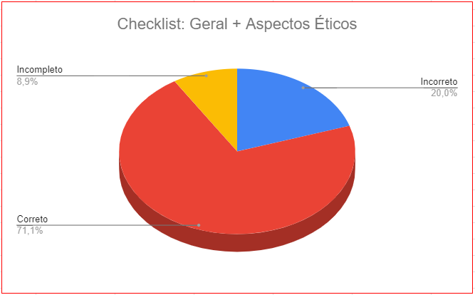

# Verificação dos Aspectos Éticos

## Introdução

Após realizado o [planejamento geral de como serão realizadas as verificações da etapa 2](https://interacao-humano-computador.github.io/2023.2-OnlineJudge/verificacao/grupo_8/etapa_2/planejamento-verificacao/), neste artefato será produzido de fato a Verificação do artefato de Aspectos Éticos.

Dessa forma, inicialmente serão apresentados os objetivos dessa verificação, a metodologia utilizada para sua realização, os responsáveis por realizá-la e as respostas dos checklists apresentados no planejamento da etapa 2. Além disso, será desenvolvida uma análise e posterior levantamento dos problemas identificados após o respectivo checklist. Sendo assim, a partir das principais incoerências encontradas, será possível trazer sugestões e avaliar a necessidade de retrabalho.

## Objetivo

O objetivo deste documento é relatar os resultados das verificações realizadas no que tange o artefato [Aspectos Éticos](https://interacao-humano-computador.github.io/2023.2-SEI-GDF/#/analise-de-requisitos/aspectos-eticos/aspectos-eticos) da Etapa 2 do [Grupo 8](https://interacao-humano-computador.github.io/2023.2-SEI-GDF/#/).

## Metodologia

Os resultados da análise deste artefato foram obtidos através da análise dos checklists de verificação preparados na página de planejamento. Dessa forma, o avaliador irá verificar o respectivo artefato do grupo e responder às questões apresentadas nos checklists, utilizando as opções **"Sim", "Não" ou "Incompleto"**, além de também poder registrar comentários em cada questão analisada para detalhar alguma observação pertinente.

## Participantes envolvidos

Conforme explicitado no tópico "Cronograma" do Planejamento da Verificação da Etapa 2, o participante do Grupo 7 responsável por essa verificação foi: [Ester Lino](https://github.com/esteerlino).

## Sumário Dos Dados - Checklists

A Tabela 1 apresenta o Checklist Geral com os dados obtidos a partir da verificação de aspectos gerais que os artefatos devem seguir.

_Tabela 1_ - Checklist para os Itens Gerais.

|  ID  |  Descrição  |  Avaliação  |  Observações  |
|  --- | ----------- | ----------- | ------------- |
| 1   | O artefato possui introdução? |  NÃO  |  Falta incluir o tópico "Introdução". |
| 2   | O artefato possui uma bibliografia/referência bibliográfica? | SIM |   |
| 3   | O artefato possui um histórico de versões com o id e descrição das versões, data, autores e revisores padronizado? | SIM |   |
| 4   | Todas as tabelas e imagens são chamadas no texto, possuem legenda e fonte? | INCOMPLETO |  Falta citar a figura no texto. |
| 5   | Todos os textos estão na norma padrão? | SIM |   |
| 6   | Os vídeos produzidos estão na categoria "não listado" no youtube?  |  -  |  O artefato não necessita de vídeos |

Fonte: [Ester Lino](https://github.com/esteerlino), 2023.

Já a Tabela 2 apresenta o checklist referente aos itens exigidos para os Aspectos Éticos.

_Tabela 2_ - Checklist para os Aspectos Éticos

| ID  |        Questão       |     Resposta     |     Comentário     |
| :-: | :-------------------:| :--------------: | :----------------: |
|  1  | Existe o artefato Aspectos Éticos? |     SIM     |            |
|  2  | Esse artefato considera Aspectos Éticos de Pesquisas Envolvendo Pessoas no projeto? |     SIM     |            |
|  3  | O artefato apresenta os 4 princípios (da autonomia, da beneficência, princípio da não maleficência e da justiça e equidade)? |      SIM    |            |
|  4  | O artefato informa que o grupo solicitará a permissão para gravar a voz ou imagem de qualquer pessoa, antes de começar a gravação?  |     NÃO     |            |
|  5  | Possui o termo de consentimento livre e esclarecido dos participantes? |     SIM     |            |

Fonte: [Ester Lino](https://github.com/esteerlino), 2023.

## Problemas encontrados

A partir do preenchimento da tabela 1 e 2, a seguir serão realizadas as considerações acerca dos itens mencionados com "NÃO" ou "INCOMPLETO".

### ID 1 (checklist Geral): O artefato possui introdução?

Não. O artefato já inicia com o texto sobre os 4 princípios, sem deixar claro do que se trata o artefato em questão.

### ID 4 (checklist Geral): Todas as tabelas e imagens são chamadas no texto, possuem legenda e fonte?

É possível observar que a imagem do termo de consentimento não está referenciada no texto do artefato.

### ID 4 (checklist Aspectos Éticos):  O artefato informa que o grupo solicitará a permissão para gravar a voz ou imagem de qualquer pessoa, antes de começar a gravação?

No artefato [Aspectos Éticos](https://interacao-humano-computador.github.io/2023.2-SEI-GDF/#/analise-de-requisitos/aspectos-eticos/aspectos-eticos) não existe nada sobre a solicitação da permissão para gravar voz ou imagem dos participantes envolvidos na avaliação do site.

## Síntese dos dados encontrados

Dessa forma, a partir das respostas coletas nos checklists acima foi possível sintetizar dados encontrados em formato de gráfico, conforme pode ser visto na Figura 1.

Figura 1 - Gráfico com resultado dos Checklists Geral e Aspectos Éticos.

 
<b>Fonte:</b> <a href="https://github.com/esteerlino">Ester Lino</a>, 2023.</a>

## Sugestões de Correções

Por fim, a partir das informações coletas, apresentadas e analisadas acima, sugere-se realizar as seguintes correções:

- Adicionar o tópico "Introdução' ao artefato;
- Adicionar as chamadas à figura no texto;
- Adicionar informações se o grupo solicitou ou não a permissão para gravar os participantes envolvidos no projeto.

## Retrabalho

Para a realização do retrabalho é sugerido que os próprios autores do artefato verificado realizem a correção dos problemas apresentados seguindo a lista de sugestão apresentada no tópico anterior.

Se necessário, outros membros do grupo 8 podem realizar as correções propostas, porém, deve-se informar a mudança realizada na Tabela 3 pois selecionou-se exatamente o responsável por essa página de acordo com a tabela do Histórico de Versões.

O responsável do grupo 7 por essa verificação irá realizar uma revisão das correções feitas, verificando se as correções foram executadas com exatidão. Assim que todas as alterações forem implementadas, deve-se alterar o campo "Status" da Tabela 3 apresentada a seguir de "Em análise" para "Finalizado".

**Tabela 3** - Cronograma de Retrabalho.

| Data de Correção | Descrição                          |                   Responsável(eis)                   |                   Revisor(es)                    |   Status   |
| ---------------- | :--------------------------------- | :--------------------------------------------------: | :----------------------------------------------: | :--------: |
| 17/11/2023       | Realizar os ajustes da verificação dos Aspectos Éticos| [Caio Mesquita](https://github.com/Caiomesvie) | [Ester Lino](https://github.com/esteerlino) | Em análise |

Fonte: [Ester Lino](https://github.com/esteerlino), 2023.

## Bibliografia

> <a id="REF1" href="#anchor_1">1.</a> BARBOSA, S. D. J.; SILVA, B. S. Interação Humano-Computador. Rio de Janeiro: Elsevier, 2011.

## Histórico de Versões

| Versão | Data       | Descrição                            | Autor(es)                                        | Revisor(es)                                     |
| ------ | ---------- | ------------------------------------ | ------------------------------------------------ | ----------------------------------------------- |
| 1.0  | 14/11/2023 | Criação da página Verificação dos Aspectos Éticos  | [Ester Lino](https://github.com/esteerlino) | [Eric Camargo](https://github.com/ericcs10) |
